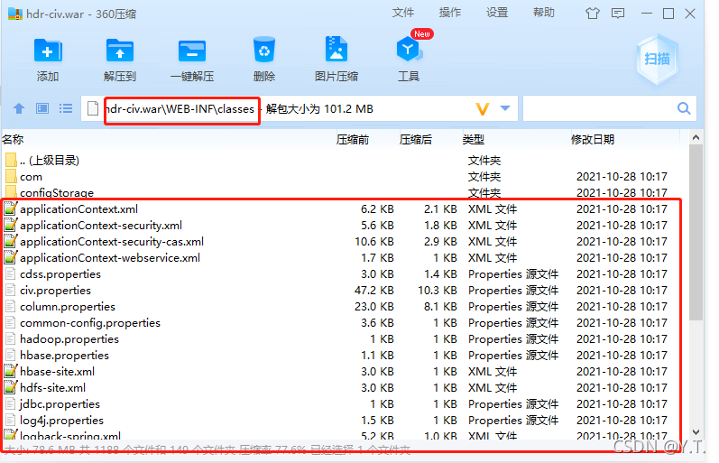
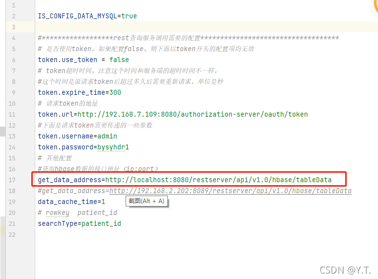
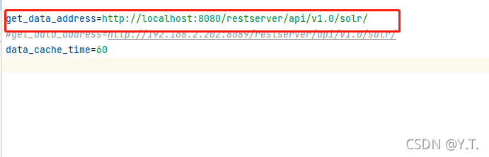
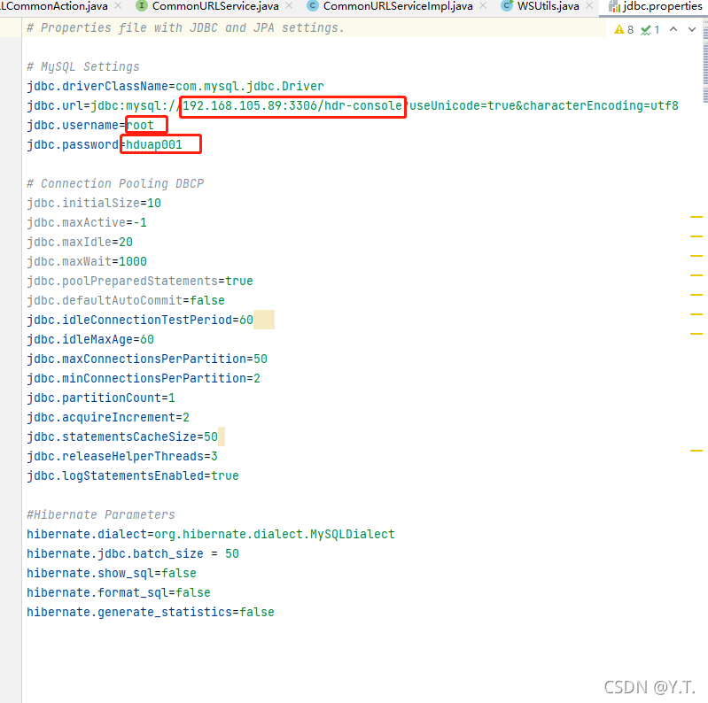
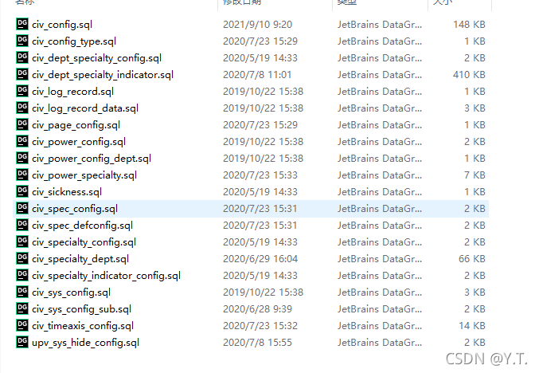

# 安装hdr-civ包

## 找到配置文件

用解压软件打开hdr-civ包（例如，用360压缩打开），在`\WEB-INF\classes` 目录下，找出配置文件

## 修改hbase.properties

修改地址为restserver的地址，通常restserver与hdr-civ安装在同一个tomcat中，只改动tomcat所在主机的IP地址和tomcat端口即可。

## 修改solr.properties

修改地址为restserver的地址，只改动tomcat所在主机的IP地址和tomcat端口即可。

## 修改jdbc.properties

统一视图的页面资源和用户要在控制台项目中进行管理，需要共用同一个mysql数据库，因此修改jdbc连接信息。

更改完配置之后，将hdr-civ包传入Tomcat的webapp中。

## 在mysql库中建表

将建表sql文件在mysql库中执行（不同的ui工具操作不一样，不再细述），建立20张表。

至此，hdr-civ包准备完毕。