# 部署solr全量抽数包


## 3.3 部署solr全量抽数包

全量抽数目标分为患者信息全量和患者就诊列表全量。
部署solr全量抽数包之前，要先建立solr的患者信息collection和就诊列表collection。

### 3.3.1 建立患者信息collection

在cm界面上查看solr的主机，用ssh工具连接到solr的主机。

##### 3.3.1.1 在本地生成solr 配置目录

依次执行下列命令

```shell
# 生成文件夹
mkdir /home/solr/
# 查看配置实体，有的现场之前可能生成过配置实体
solrctl instancedir --list
# 生成配置实体（有就不必执行，solrPatient是配置实体名）
solrctl instancedir --generate /home/solr/solrPatient
```

##### 3.3.1.2 更新schema.xml文件

在/home/solr/solrPatient/目录下找到schema.xml文件，使用vi指令打开（vi指令是linux基本命令，百度资料很全）。

```shell
vi /home/solr/solrPatient/schema.xml
```

在`的节点中新增下面内容

```xml
<field name="PERSON_NAME" type="string" indexed="true" stored="true" /> <!--患者姓名-->
<field name="IN_PATIENT_ID" type="string" indexed="true" stored="true" />  <!--住院患者ID-->
<field name="INP_NO" type="string" indexed="true" stored="true" />             <!--住院号-->
<field name="OUT_PATIENT_ID" type="string" indexed="true" stored="true" /> <!--门诊患者ID-->
<field name="OUTP_NO" type="string" indexed="true" stored="true" />           <!--门诊号-->
<field name="EID" type="string" indexed="true" stored="true" />                     <!--索引ID-->
<field name="DATE_OF_BIRTH" type="string" indexed="true" stored="true" />  <!--出生年月-->
<field name="SEX_NAME" type="string" indexed="true" stored="true" />          <!--性别-->
<field name="VISIT_TYPE_CODE" type="string" indexed="true" stored="true" /> <!--就诊类型-->
<field name="ID_CARD_NO" type="string" indexed="true" stored="true" />         <!--身份证号-->
<field name="BRID" type="string" indexed="true" stored="true" />         <!--brid-->
<field name="OID" type="string" indexed="true" stored="true" />         <!--多院区OID-->
<field name="GLOBLE_ID" type="string" indexed="true" stored="true" />         <!--多院区间患者唯一标识GLOBLE_ID-->
```

##### 3.3.1.3 更新solrconfig.xml文件

修改在/home/solr/solrPatient/目录下solrconfig.xml文件，将openSearcher改为true

```shell
     <autoCommit>
       <maxTime>${solr.autoCommit.maxTime:60000}</maxTime>
       <openSearcher>true</openSearcher>
     </autoCommit>
```

##### 3.3.1.4 创建配置实体

```shell
solrctl instancedir --create solrPatient /home/solr/solrPatient
```

##### 3.3.1.5 创建collection

```shell
solrctl collection --create collpatient -s 1 -r 3 -c solrPatient
```

至此，solr患者信息collection创建完毕，可进入solr 管理界面查看

##### 3.3.1.6 创建失败时的补救措施

查看配置实体

```shell
solrctl instancedir --list
```

先更新配置文件，再刷新solr配置

```shell
solrctl instancedir --update solrPatient /home/solr/solrPatient 
solrctl collection --reload collpatient 
```

删除collection

```shell
solrctl collection --delete collpatient
```

删除配置实体

```shell
solrctl instancedir --delete solrPatient
```

### 3.3.2 部署solr患者信息全量抽数包

##### 3.3.2.1 找到配置文件

用压缩软件打开hbasesolr.jar包，往下拉进度条，找到配置文件，
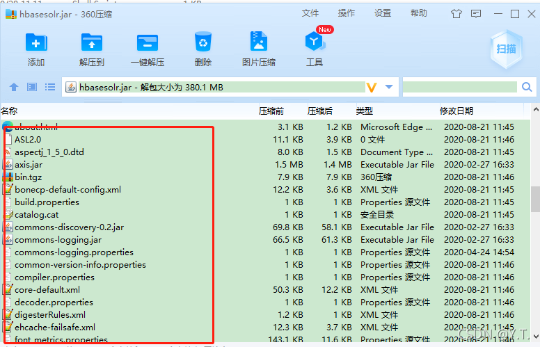

##### 3.3.2.2 修改hadoop.properties


`org_oid`、`patient_id.start`和`patient_id.end`不再赘述。
`zkHost`按格式填写zookeeper的主机。
`solrserverurl`在solr管理页面选中患者信息collection，从浏览器的url中复制即可。


##### 3.3.2.3 替换集群配置文件hdfs-site.xml和hbase-site.xml

##### 3.3.2.4 修改hbase.properties

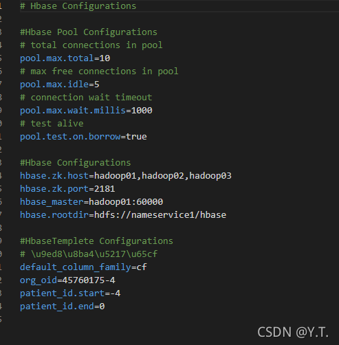
同上文一样，不再赘述。
至此，配置文件全部修改完毕，替换进包中，将抽数包和启动脚本hbasesolr.sh放进任意一台solr服务器中。

##### 3.3.2.5 修改启动脚本

将启动脚本中的路径改正为jar包放置的路径，设置定时任务每天运行脚本。
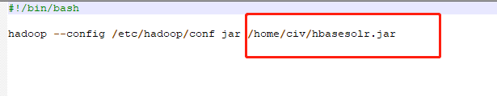

### 3.3.3 建立solr患者就诊collection

在2.3.1中的主机中，执行命令，以便管理

##### 3.3.3.1 生成solr 配置目录

```shell
solrctl instancedir --generate /home/solr/civlist
```

##### 3.3.3.2 配置sechema.xml文件

打开文件进行编辑

```shell
vi /home/solr/civlist/config/sechema.xml
```

在`的节点中新增下面内容

```shell
<field name="EID" type="string" indexed="true" stored="true" /> <!--EID-->
<field name="IN_PATIENT_ID" type="string" indexed="true" stored="true" />       <!--住院患者ID-->
<field name="OUT_PATIENT_ID" type="string" indexed="true" stored="true" />      <!--门诊患者ID-->
<field name="VISIT_ID" type="string" indexed="true" stored="true" />    <!--就诊次数-->
<field name="PERSON_NAME" type="string" indexed="true" stored="true" /> <!--姓名-->
<field name="SEX_NAME" type="string" indexed="true" stored="true" />    <!--性别-->
<field name="SEX_CODE" type="string" indexed="true" stored="true" />    <!--性别CODE-->
<field name="AGE_VALUE" type="string" indexed="true" stored="true" />   <!--年龄-->
<field name="AGE_NUM" type="int" indexed="true" stored="true" />        <!--年龄值-->
<field name="AGE_UNIT" type="string" indexed="true" stored="true" />    <!--年龄单位-->
<field name="DATE_OF_BIRTH" type="string" indexed="true" stored="true" />       <!--出生年月-->
<field name="ID_CARD_NO" type="string" indexed="true" stored="true" />  <!--身份证号-->
<field name="VISIT_TYPE_CODE" type="string" indexed="true" stored="true" />     <!--就诊类型CODE-->
<field name="VISIT_TYPE_NAME" type="string" indexed="true" stored="true" />     <!--就诊类型-->
<field name="INP_NO" type="string" indexed="true" stored="true" />      <!--住院号-->
<field name="OUT_NO" type="string" indexed="true" stored="true" />      <!--门诊号-->
<field name="DEPT_ADMISSION_TO_NAME" type="string" indexed="true" stored="true" />      <!--入院科室，门诊就诊科室-->
<field name="DEPT_ADMISSION_TO_CODE" type="string" indexed="true" stored="true" />      <!--入院科室，门诊就诊科室CODE-->
<field name="DEPT_DISCHARGE_FROM_NAME" type="string" indexed="true" stored="true" />    <!--出院科室-->
<field name="DEPT_DISCHARGE_FROM_CODE" type="string" indexed="true" stored="true" />    <!--出院科室CODE-->
<field name="ADMISSION_TIME" type="date" indexed="true" stored="true" />        <!--入院时间，门诊就诊时间-->
<field name="DISCHARGE_TIME" type="date" indexed="true" stored="true" />        <!--出院时间-->
<field name="IN_HOSPITAL_DAYS" type="string" indexed="true" stored="true" />    <!--住院天数-->
<field name="BED_LABEL" type="string" indexed="true" stored="true" />   <!--床号-->
<field name="DISCHARGE_BED" type="string" indexed="true" stored="true" />       <!--出院床号-->
<field name="DIAGNOSIS_CODE" type="string" indexed="true" stored="true" />      <!--诊断编码-->
<field name="DIAGNOSIS_NAME" type="string" indexed="true" stored="true" />      <!--诊断名称-->
<field name="HOME_PHONE" type="string" indexed="true" stored="true" />  <!--联系电话-->
<field name="HOSPITAL_STATE" type="string" indexed="true" stored="true" />      <!--住院状态-->
<field name="REQUEST_DOCTOR" type="string" indexed="true" stored="true" />      <!--三级经治医师-->
<field name="PARENT_DOCTOR" type="string" indexed="true" stored="true" />       <!--三级上级医师-->
<field name="SUPER_DOCTOR" type="string" indexed="true" stored="true" />        <!--三级主任医师-->
<field name="TMP_HOUSEMAN" type="string" indexed="true" stored="true" />        <!--实习医生姓名或进修医生姓名-->
<field name="IN_OUT_NOS" indexed="true"  stored="true" type="string" multiValued="true"/>
<field name="DEPT" type="string" indexed="true" stored="true" />        <!--科室-->
<field name="DISTRICT_ADMISSION_TO_CODE" type="string" indexed="true" stored="true" />  <!--院区-->
<field name="DISTRICT_ADMISSION_TO_NAME" type="string" indexed="true" stored="true" />  <!--院区-->
<field name="OID" type="string" indexed="true" stored="true" /> <!--OID院区-->
<field name="GLOBLE_ID" type="string" indexed="true" stored="true" />   <!--院区间患者唯一标识GLOBLE_ID--> 
```

##### 3.3.3.3 创建配置实体

```
 solrctl instancedir --create solrcivlist /home/solr/civlist
```

##### 3.3.3.4 创建collection

```
solrctl collection --create collectioncivlist -c solrcivlist -s 1 -r 3 -m 3
```

至此，患者就诊collection创建完毕，可在管理页面查看
创建失败时，补救命令参照2.3.1.6节

### 3.3.4 部署solr患者就诊全量抽数包

##### 3.3.4.1 找到配置文件

用压缩软件打开hbasesolrV2_full.jar 包，往下拉进度条，找到配置文件。
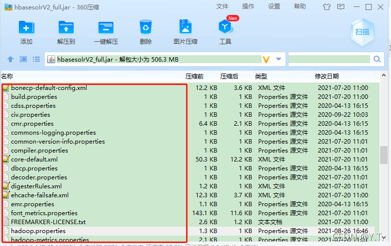

##### 3.3.4.2 修改hadoop.properties


重复项不再赘述.
kakfa配置中的zk_list按格式填zookeeper主机；
broker_list按格式填kafka的broker组件所在主机
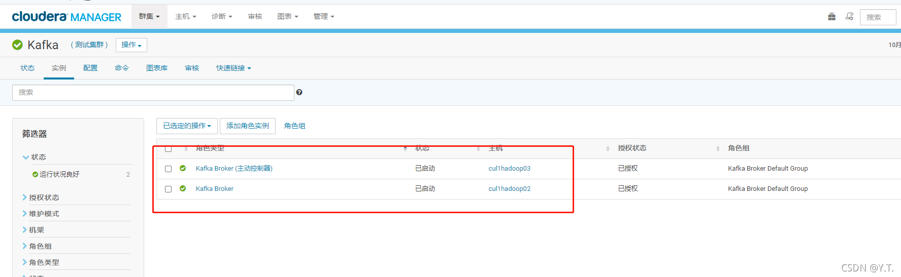

##### 3.3.4.3 修改hbase.properties

同上文一样，不再赘述

##### 3.3.4.4 替换集群配置文件hdfs-site.xml和hbase-site.xml

##### 3.3.4.5 修改启动脚本

打开`patlist_proc.sh`脚本，内容中echo是打印命令，忽略不看的话，可以清晰的发现脚本由3部分组成：
第一步，使用hbase命令建立一张hbase表；
第二步，使用hive命令处理sql脚本
第三步，使用spark命令处理刚刚配置好的就诊列表抽数包
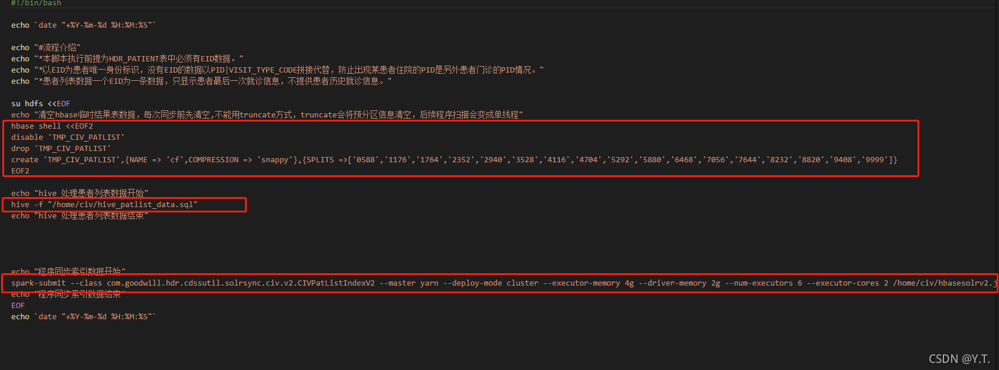
默认情况，门诊和住院使用统一的patient_id，直接更改hive命令的文件路径指向hive_patlist_data.sql；如果现场，门诊和住院的patient_id不一致，需要使用hive_patlist_data_isolation.sql文件，现场人员需要点开对应的sql文件，在插入结果表时，修改rowkey的反转规则，如下图：
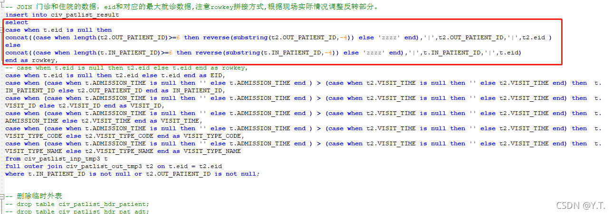

按情况修改patlist_proc.sh脚本。
修改spark命令指向配置好的就诊列表抽数包，上面截图的第三部分。
将改好的抽数包，sql文件，启动脚本上传至服务器，设置定时任务跑脚本。
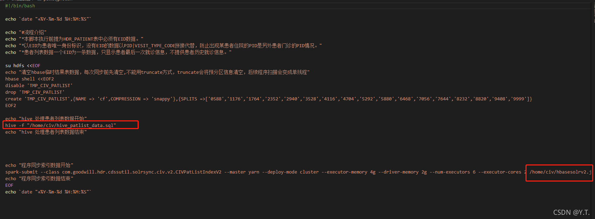

##### 3.3.4.6 就诊列表抽数查错指导

根据抽数脚本可以明白，报错原因可能有2点：hive计算问题和spark计算问题。
先通过控制台打开脚本中新建的hbase表。

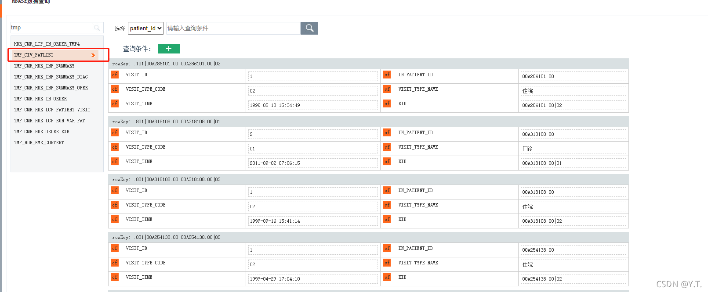
观察数据，若无问题则是spark计算问题；若数据不符预期，则打开sql文件，在hive中观测每一段sql的执行结果。

###### 3.3.4.6.1 spark定位问题

当确定问题在spark计算结果不合预期时，打开cm界面，进入spark主页，打开web ui
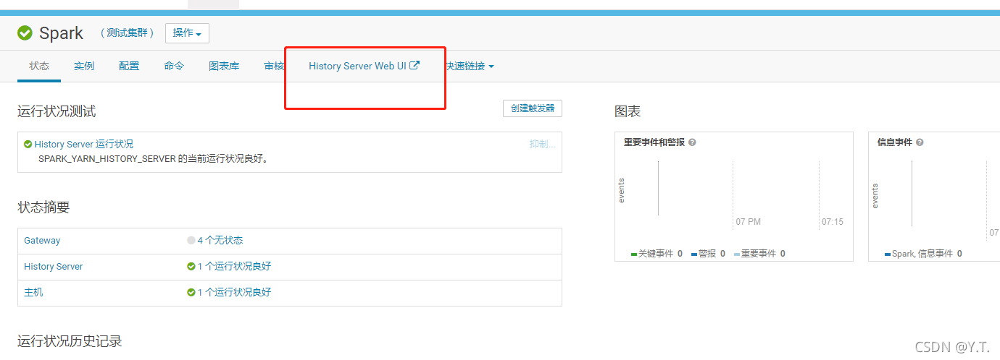
可以看到，访问的url默认是主机名加端口，如果打不开改页面，检查host文件有没有配置服务器主机名（配置host文件属于基本，百度资料很多）
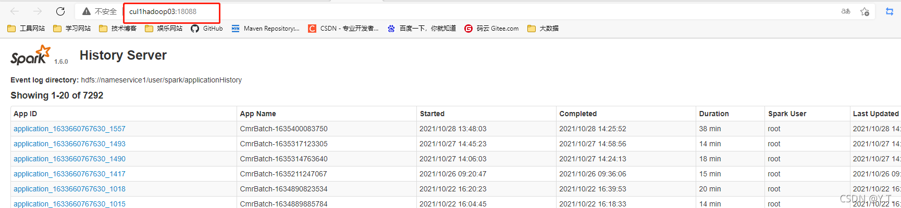
在页面中选中脚本执行的app id，点进去，再点击Executors，查看logs中的err日志，根据日志定位问题。
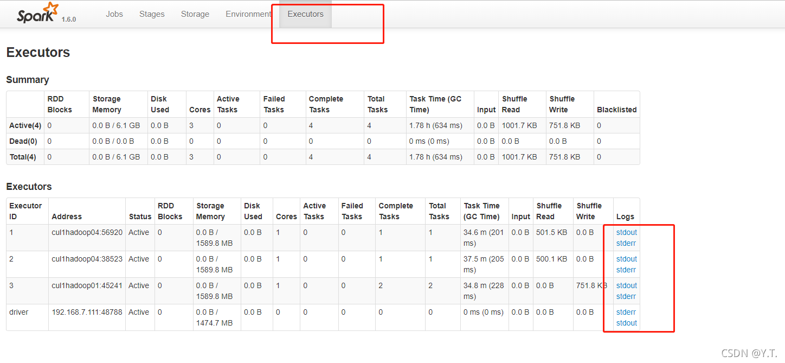

###### 3.3.4.6.2 hive查看数据问题


若hive计算出的TMP_CIV_PATLIST表中数据不合预期，进入cm界面中的hue主页，打开 web ui
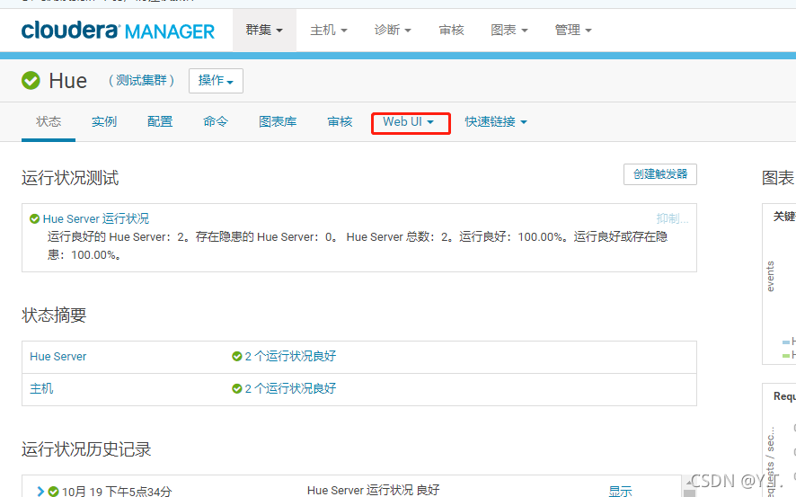


登陆进入hue ui界面后，左侧是数据库，右侧选择hive的查询界面
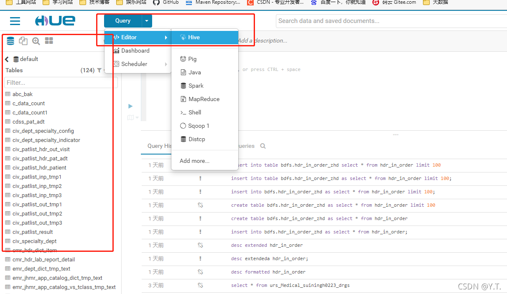
打开sql文件，可以发现sql文件大致分为三步：
第一步，建立hbase的外表，即hive中的表跟hbase的表数据实时同步。再将外表转换成hive内表，加快计算速度。
第二步，用内表进行数据计算。
第三步，将计算结果按情况插入hbase外表中（对应TMP_CIV_PATLIST)

建立外表的语句形如下图。
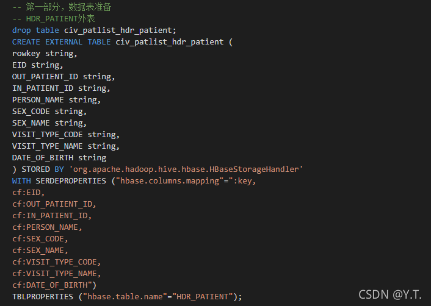
利用hue的hive查询功能，分步执行计算过程，观察定位问题