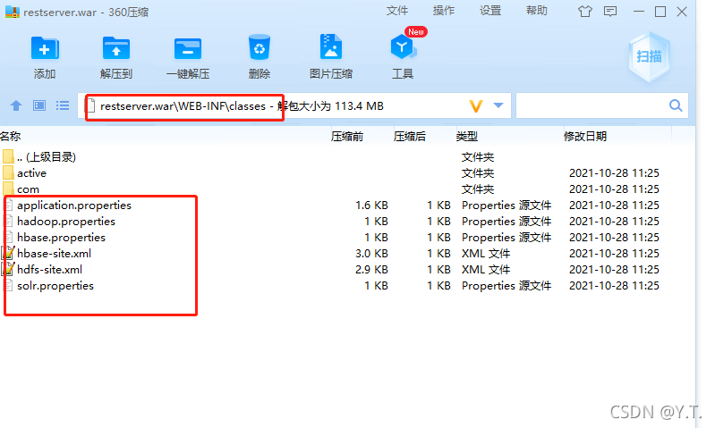
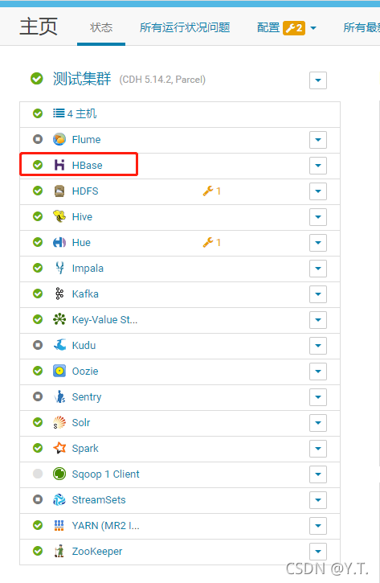
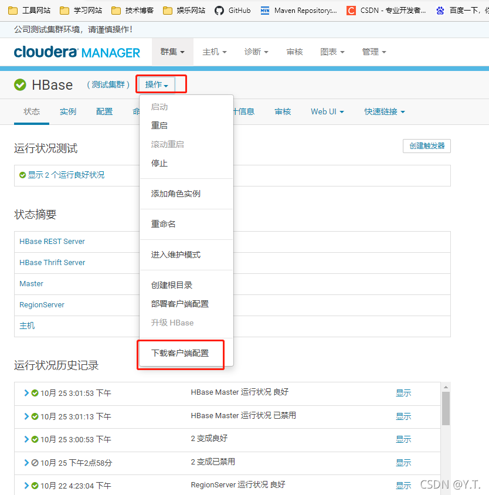
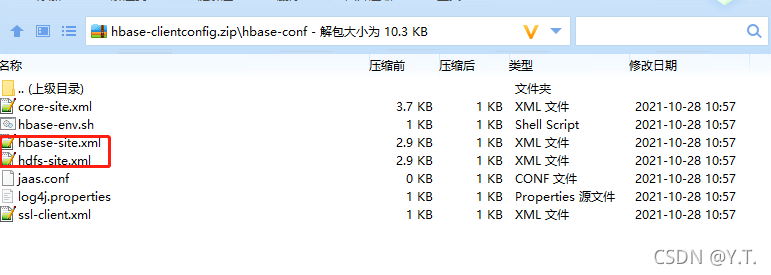
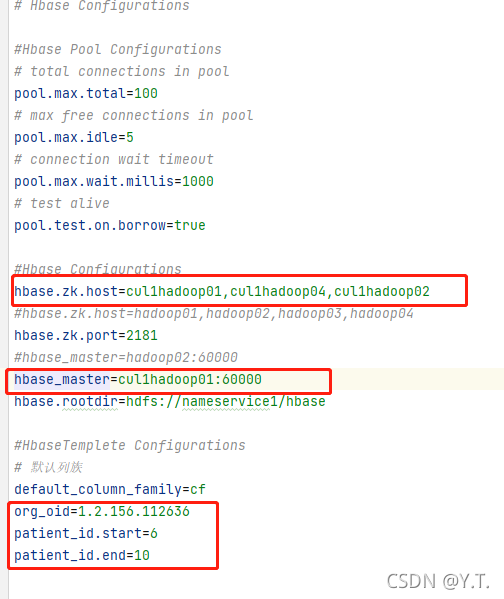
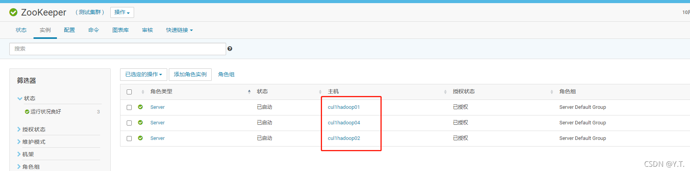
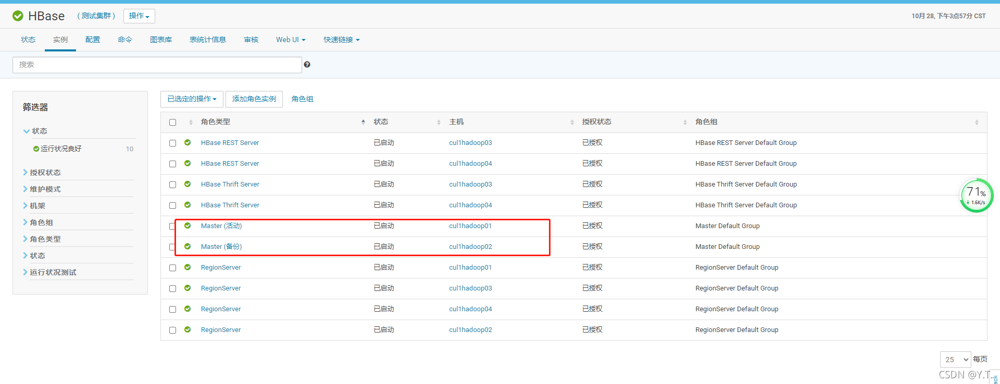
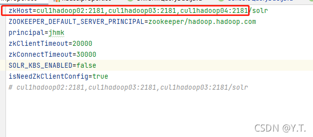

# 安装restserver包

## 找到配置文件

打开restserver.war压缩包，找到配置文件，取出待修改。

## 下载集群配置文件

hdfs-site.xml和hbase-site.xml两个文件作为集群的配置文件，可以从cloudera manger界面（简称cm）下载。
选中hbase,单击进入hbase管理页

单击操作，下载客户端配置

解压客户端配置，将配置文件替换进restserver包里

## 修改hbase.properties

打开cm界面的zookeeper页面

将zookeeper的主机名填入`hbase.zk.host`属性中。
打开hbase的主页

将2个master的主机名填入`hbase_master`属性中，端口号默认60000不变。
`org_oid`填现场的组织机构id。
`patient_id.start`和`patient_id.end`用于设置截取patient_id拼接rowkey的规则，根据现场的patient_id反转规则来填（通常截取后四位反转)。截取的子字符串从指定的`patient_id.start`开始，并扩展到索引`patient_id.end`- 1处的字符，总长度为`patient_id.end`-`patient_id.start`。索引从左向右是从0开始计数的，例如:
“hamburger” 设置start为4，end为8时，返回值是 “urge”

## 修改solr.properties

填入zookeeper的主机名即可，其他不用动。（/solr不能去掉)
将配置文件都替换进war包中，将war包置于tomcat的webapp目录下，启动tomcat即可。