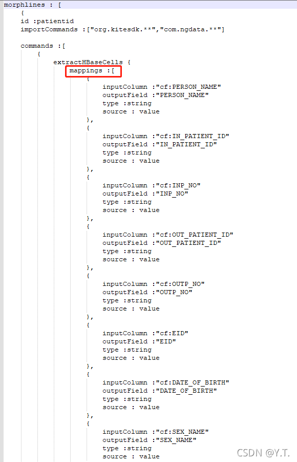
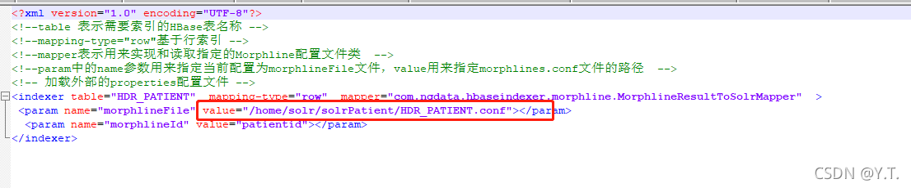

# 部署solr实时抽数包


实时solr同样区分患者信息和就诊列表。
实时更新患者统一视图的逻辑如下：
1.实时患者基本信息和患者主索引通过集成平台调用数据中心EDI接口存入HDR_PATIENT， 并设置发实时队列kafka
2.通过Key-Value Store Indexer实时设置HDR_PATIENT的collpatient进行实时更新solr
3.实时就诊的门诊就诊和入出转通过集成平台调用数据中心EDI接口存入HDR_OUT_VISIT和HDR_PAT_ADT，并设置发实时队列kafka
4.部署sqark程序监测kafka的topic消息，进行实时更新患者末次就诊列表civpatlist的solr数据


## 3.4.1 设置Key-Value Store Indexer实时更新solr患者基本信息collection


##### 3.4.1.1 给HDR_PATIENT表开启复制功能

先进入hbase shell

```shell
hbase shell
```

在shell里查看HDR_PATIENT表结构

```shell
describe 'HDR_PATIENT'
```

若结果中，`REPLICATION_SCOPE`的值不满足`REPLICATION_SCOPE => 1`，表示未开启复制功能。
更改表

```shell
disable 'HDR_PATIENT'
alter 'HDR_PATIENT',{NAME => 'cf', REPLICATION_SCOPE => 1}
enable 'HDR_PATIENT'
```


##### 3.4.1.2 上传 Key-Value Store Indexer 配置


打开HDR_PATINET.conf文件，可以看到mappings中即为hbase到solr的字段映射，如有缺失可自行补充。



打开HDR_PATIENT.xml文件，将路径指向刚刚conf文件，一起上传至安装有Key-Value Store Indexer的服务器。




##### 3.4.1.3 注册服务

注册服务

```shell
 hbase-indexer add-indexer  \
--name HDR_PATIENT  \
--indexer-conf /home/solr/solrPatient/HDR_PATIENT.xml \
--connection-param solr.zk=hadoop04:2181,hadoop03:2181/solr  \
--connection-param solr.collection=collpatient \
--zookeeper hadoop02:2181,hadoop03:2181,hadoop04:2181
```

查看实时索引器

```shell
  hbase-indexer list-indexers -dump --zookeeper hadoop02:2181,hadoop03:2181,hadoop04:2181
```

如报错，删除实时索引

```shell
  hbase-indexer delete-indexer -n HDR_PATIENT --zookeeper  hadoop02:2181,hadoop03:2181,hadoop04:2181
```


##### 3.4.1.4 添加一条数据测试

进入hbase命令

```shell
hbase shell
```

添加数据

```shell
put 'HDR_PATIENT','12345678901','cf:IN_PATIENT_ID' ,'12345678901'
```

添加完需要在hdr控制台和solr查询，验证结果
删除数据

```shell
deleteall 'HDR_PATIENT','12345678901'
```


## 3.4.2 使用spark实时更新solr患者就诊列表collection


复制一份患者就诊列表的全量抽数包，改名为hbasesolrV2_realtime.jar


##### 3.4.2.1 使用spark执行

注意命令中的路径，该jar包执行起来永不停止，持续监听kafka

```shell
spark-submit --class com.goodwill.hdr.cdssutil.solrsync.civ.v2.CIVPatListPatientAddV2 --master yarn --deploy-mode cluster --executor-memory 3g --driver-memory 2g --num-executors 4 --executor-cores 2 /home/realtime/hbasesolrV2_realtime.jar
```


##### 3.4.2.2 配置edi程序

打开 tomcat 中 edi程序 ，配置solr.properties中的 `kafka.switch = true`
现场人员在实时消息中添加`<kafka>true</kafka>`