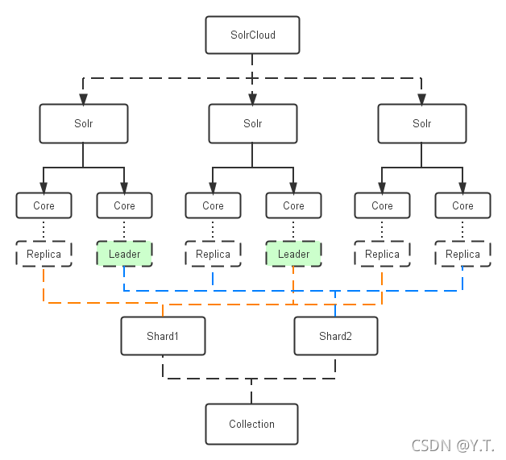
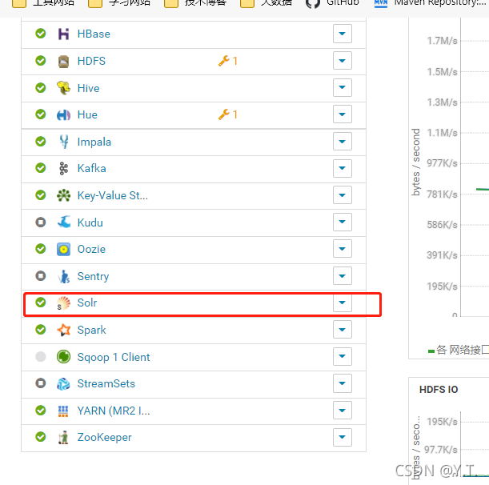
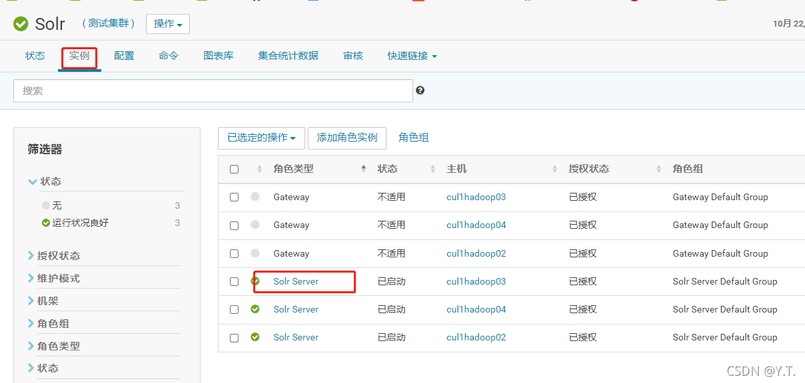
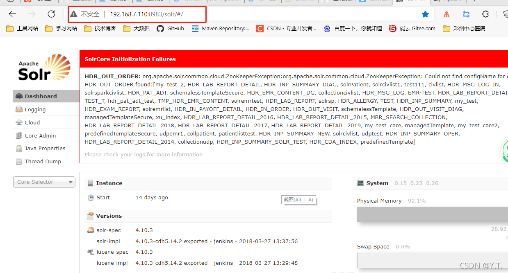
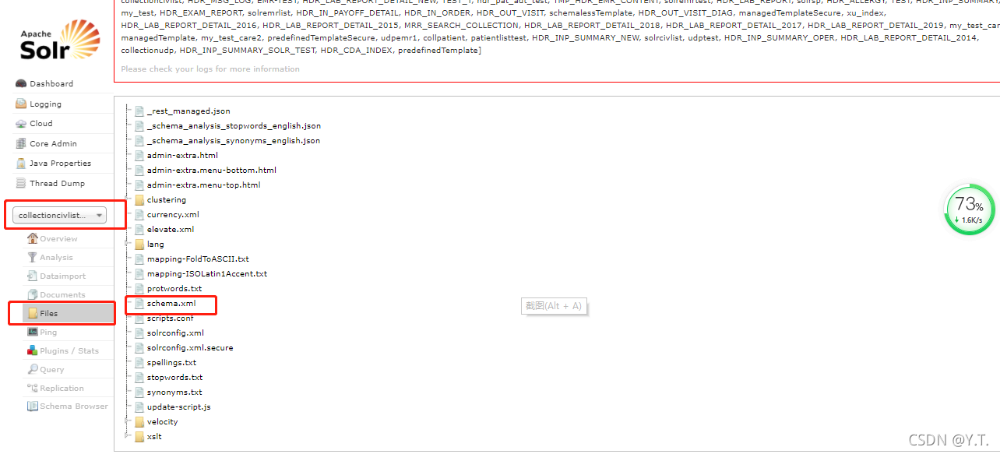
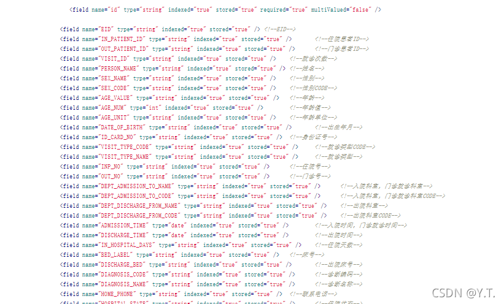
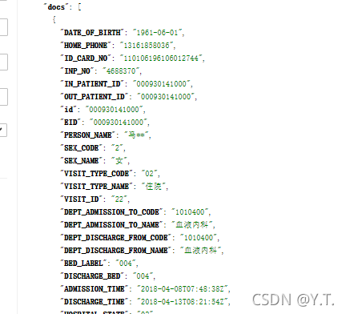
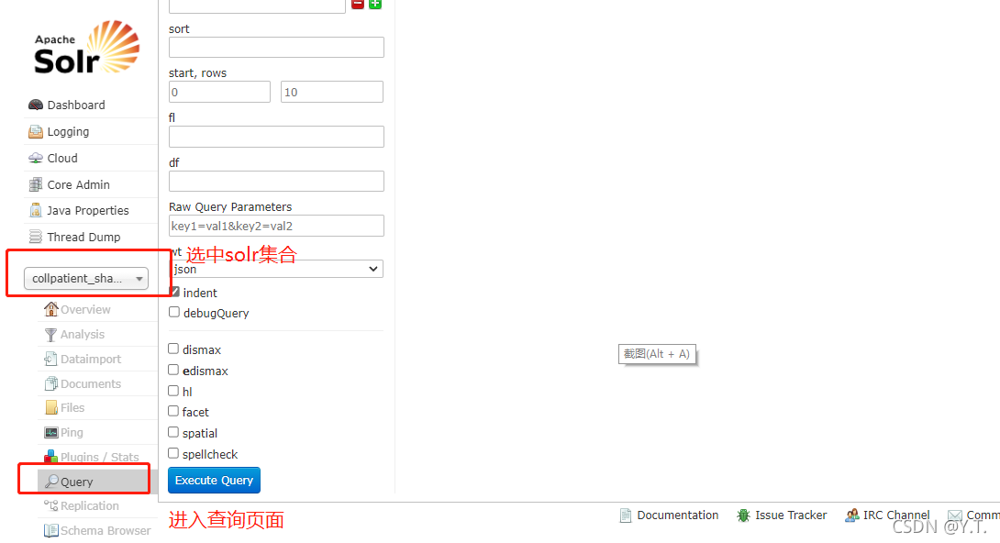
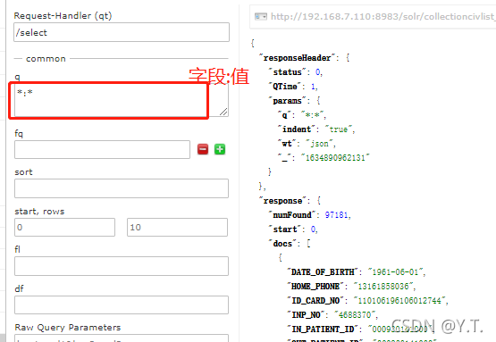
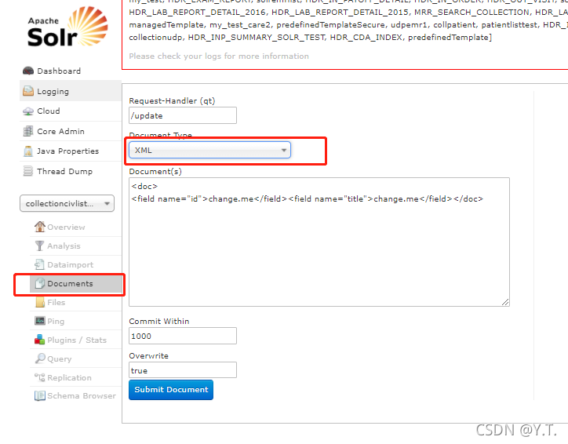

# Solr


solr是一个搜索引擎，按照键值对存储数据，可以用任意字段快速搜索对应的数据。属于hadoop集群的组件，不用单独安装。





如图，上半部分，集群多台服务器上安装了solr 服务，多个solr服务组合成solr cloud，应用程序直接查询solr cloud。


## 1.3.1 solr管理页面


进入集群管理页面,找到solr组件



在实例中找到solr server的主机




访问任意一台主机的sorl端口（默认：8983），即进入solr管理页面
示例地址为：http://192.168.7.110:8983/solr/





## 1.3.2 solr的一些概念


### 1.3.2.1 collection

solr的中的collection近似于mysql的表，是一个跨越多个服务器的逻辑上的表，通过一个schema.xml文件来约束存储的字段。

打开schema.xml文件：




文件中配置字段约束的地方




最终存储的数据




### 1.3.2.2 core（了解）
core是collection的组成部分，一个collection由分布在不同节点的core组成。core是每台服务器存储数据的实体部分，刚才在页面选择colleciton的时候，实际选择的是core。


### 1.3.2.3 Shard （了解）
Collection的逻辑分片。每个Shard被化成一个或者多个replicas，通过选举确定哪个是Leader。


### 1.3.2.4 Replica（了解）
Shard的一个拷贝。每个Replica存在于Solr的一个Core中。换句话说一个Solr Core对应着一个Replica


## 1.3.4 用页面进行管理


### 1.3.4.1 查询

选中core，进入查询页面





输入条件查询数据




### 1.3.4.2 删除


进入document，选中xml格式，输入：

```xml
<delete><query>*:*</query></delete>
<commit/>
```


筛选出符合条件的数据删除。




