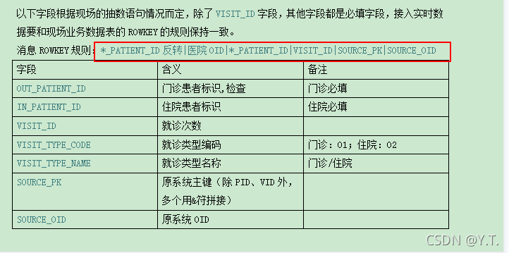

# 1.4 hbase

hbase是hadoop组件之一，不用单独安装。
它是一种NoSQL数据库，这意味着它不像传统的关系型数据库（如mysql）那样支持SQL作为查询语言，字段也没有强约束，仅能通过rowkey查询数据。

控制台提供了hbase查询的功能，能满足大部分场景，要求hbase的rowkey按规则抽取。`*_PATIENT_ID`作为参数传入，程序将按照如图规则自动拼接rowkey进行查询。

