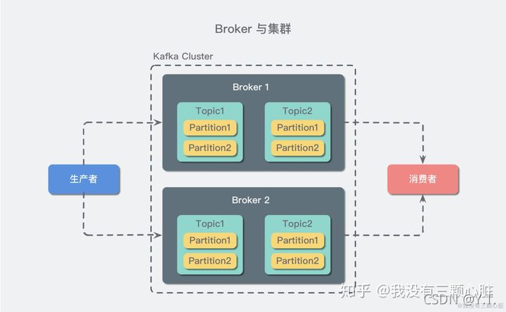

# Kafka

一个 Kafka 服务器也称为 Broker，它接受生产者发送的消息并存入磁盘；Broker 同时服务消费者拉取分区消息的请求，返回目前已经提交的消息。使用特定的机器硬件，一个 Broker 每秒可以处理成千上万的分区和百万量级的消息。

若干个 Broker 组成一个集群（Cluster），其中集群内某个 Broker 会成为集群控制器（Cluster Controller），它负责管理集群，包括分配分区到 Broker、监控 Broker 故障等。在集群内，一个分区由一个 Broker 负责，这个 Broker 也称为这个分区的 Leader；当然一个分区可以被复制到多个 Broker 上来实现冗余，这样当存在 Broker 故障时可以将其分区重新分配到其他 Broker 来负责。