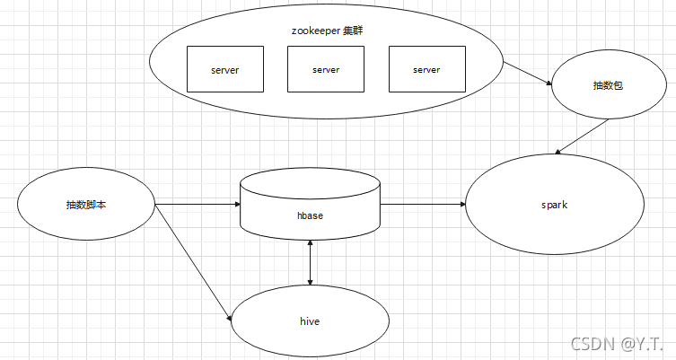
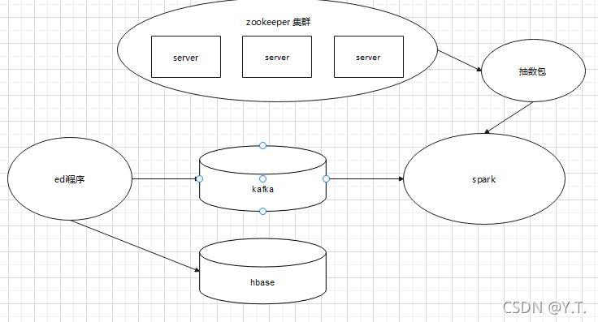

# 推荐硬件架构


如图，分配4台服务器搭建hadoop集群，2台服务器搭载应用。客户（医院）只访问应用服务器。

solr、hbase分布于存储节点服务器上
tomcat 分布于应用服务器
nginx 放置一台应用服务器上


# 统一视图软件架构

## 统一视图应用软件架构


如图，用户通过浏览器访问统一视图过程：

- 浏览器输入nginx地址（8080端口，例如：192.168.xx.xx:8080/hdr-civ）。
- nginx 8080 端口接收到请求，自动根据用户IP将请求转发到合适的tomcat（一般为8082端口），保证tomcat负载均衡。
- tomcat处理请求，并向数据源查询数据，计算后展示给用户。
- 在3大数据源中，mysql负责存用户配置及权限数据，solr负责存储用于搜索的数据，hbase存出医院产生的患者就诊数据。

## 统一视图患者就诊列表solr全量抽数的架构



- 第一步，使用脚本在hbase里新建一张表存储hive计算结果（简称为：结果表）。
- 第二步，通过脚本设定，使用hive组件从hbase的一些表中拿出数据计算，算出患者末次就诊记录后存到结果表中。
- 第三步，通过脚本设定，使用spark组件执行抽数包程序，读取结果表进行计算，以结果表为基础，快速整合散落于多张hbase表里的数据，组成患者就诊列表，存进solr里。

## 统一视图患者就诊列表solr实时抽数的架构


实时就诊的门诊就诊和入出转通过集成平台调用数据中心EDI接口存入hbase表（`HDR_OUT_VISIT`和`HDR_PAT_ADT`）和kafka中，使用sqark按抽数包程序监测kafka的topic消息，进行实时更新患者末次就诊列表的solr数据

## 统一视图患者基本信息solr全量抽数的架构
患者基本信息的solr字段跟hbase的`HDR_PATIENT`表的字段一致，运算量不大，直接利用hadoop本身的计算功能完成数据抽取。

## 统一视图患者基本信息solr实时抽数的架构


Key-Value Store Indexer ：用于同步hbase数据和solr的数据的索引器。<br/>
非常直接，患者基本信息solr利用Key-Value Store Indexer组件配置的映射关系，将hbase的字段各自映射到solr中。

# 相关软件介绍

## zookeeper


顾名思义 zookeeper 就是动物园管理员，他是用来管 hadoop集群的管理员；它是一个分布式的、开源的程序协调服务，是 hadoop 项目下的一个子项目。他提供的主要功能包括：配置管理、名字服务、分布式锁、集群管理。

主要应用集群管理：
在分布式的集群中，经常会由于各种原因，比如硬件故障，软件故障，网络问题，有些 节点会进进出出。有新的节点加入进来，也有老的节点退出集群。这个时候，集群中其他机器需要感知到这种变化，然后根据这种变化做出对应的决策，zookeeper便可以解决这些问题。

## Kafka


一个 Kafka 服务器也称为 Broker，它接受生产者发送的消息并存入磁盘；Broker 同时服务消费者拉取分区消息的请求，返回目前已经提交的消息。使用特定的机器硬件，一个 Broker 每秒可以处理成千上万的分区和百万量级的消息。

若干个 Broker 组成一个集群（Cluster），其中集群内某个 Broker 会成为集群控制器（Cluster Controller），它负责管理集群，包括分配分区到 Broker、监控 Broker 故障等。在集群内，一个分区由一个 Broker 负责，这个 Broker 也称为这个分区的 Leader；当然一个分区可以被复制到多个 Broker 上来实现冗余，这样当存在 Broker 故障时可以将其分区重新分配到其他 Broker 来负责。

## Hbase

hbase是hadoop组件之一，不用单独安装。
它是一种NoSQL数据库，这意味着它不像传统的关系型数据库（如mysql）那样支持SQL作为查询语言，字段也没有强约束，仅能通过rowkey查询数据。

控制台提供了hbase查询的功能，能满足大部分场景，要求hbase的rowkey按规则抽取。`*_PATIENT_ID`作为参数传入，程序将按照如图规则自动拼接rowkey进行查询。


## solr


solr是一个搜索引擎，按照键值对存储数据，可以用任意字段快速搜索对应的数据。属于hadoop集群的组件，不用单独安装。


如图，上半部分，集群多台服务器上安装了solr 服务，多个solr服务组合成solr cloud，应用程序直接查询solr cloud。


###  solr管理页面


进入集群管理页面,找到solr组件


在实例中找到solr server的主机


访问任意一台主机的sorl端口（默认：8983），即进入solr管理页面
示例地址为：http://192.168.7.110:8983/solr/


###  solr的一些概念


#### collection

solr的中的collection近似于mysql的表，是一个跨越多个服务器的逻辑上的表，通过一个schema.xml文件来约束存储的字段。

打开schema.xml文件：


文件中配置字段约束的地方


最终存储的数据


#### core（了解）
core是collection的组成部分，一个collection由分布在不同节点的core组成。core是每台服务器存储数据的实体部分，刚才在页面选择colleciton的时候，实际选择的是core。


#### Shard （了解）
Collection的逻辑分片。每个Shard被化成一个或者多个replicas，通过选举确定哪个是Leader。


#### Replica（了解）
Shard的一个拷贝。每个Replica存在于Solr的一个Core中。换句话说一个Solr Core对应着一个Replica


### 用页面进行管理


#### 查询

选中core，进入查询页面


输入条件查询数据


####  删除


进入document，选中xml格式，输入：

```xml
<delete><query>*:*</query></delete>
<commit/>
```


筛选出符合条件的数据删除。


## spark

Hadoop 已经成为了典型的大数据批量处理架构，它实现了两个强有力的开源产品:HDFS 和 MapReduce。由 HDFS 负责静态数据的存储,并通过 MapReduce 将计算逻辑分配到各数据节点进行数据计算。之后以 HDFS 和 MapReduce 为基础建立了很多项目,形成了 Hadoop 生态圈.

Spark 则是类似Hadoop MapReduce的通用并行框架, 专门用于大数据量下的迭代式计算.是为了跟 Hadoop 配合而开发出来的,不是为了取代 Hadoop, Spark 运算比 Hadoop 的 MapReduce 框架快，原因是因为 Hadoop 在一次 MapReduce 运算之后,会将数据的运算结果从内存写入到磁盘中,第二次 Mapredue 运算时在从磁盘中读取数据,所以其瓶颈在2次运算间的多余 IO 消耗. Spark 则是将数据一直缓存在内存中,直到计算得到最后的结果,再将结果写入到磁盘,所以多次运算的情况下, Spark 是比较快的. 其优化了迭代式工作负载。

## Tomcat


tomcat是一个流行的web服务器，将程序包放置其中，方可处理浏览器的请求。


常用命令：

- 切换目录 — cd {路径}
- 启动tomcat服务—先切换到tomcat的bin目录，执行启动脚本 ./startup.sh
- 停止tomcat服务----先查看tomcat的进程号(例如 ps -ef|grep tomcat-8082），再使用kill -9 进程号关闭tomcat进程。


- 查看tomcat运行时日志—使用tail命令查看logs/catalina.out文件即可,例如tail -f ./logs/catalina.out,tail -f 表示查看文件末尾并不断追踪


### 安装步骤


官网(https://tomcat.apache.org/) 下载tomcat，推荐版本tomcat 8


linux下载二进制文件核心包，放置服务器上（推荐为：/usr/local/tomcat目录下），使用解压命令解压（大括号之间为需要填充字段）


```shell
tar -zxvf -C /usr/local/tomcat/tomcat-{端口} {tomcat的tar包名称}
```


解压完毕后，更改tomcat端口号：

1. 进入tomcat解压目录，进入conf文件夹下
   
2. 编辑配置文件server.xml

3. 找到3个端口号，修改端口即可


以上，完成tomcat的安装


### tomcat中的统一视图


统一视图的应用包共有2个（hdr-civ.war和restserver.war），2个war包放置在tomcat的webapp目录下，启动tomcat后，将被tomcat自动识别解压出为2个同名文件夹（即启动了2个同名应用）。<br/>

hdr-civ负责处理用户请求逻辑并从mysql中读取用户配置及权限，最终给用户展示页面；restserver接收hdr-civ的请求，去solr和hbase查询数据，返回给civ处理。


