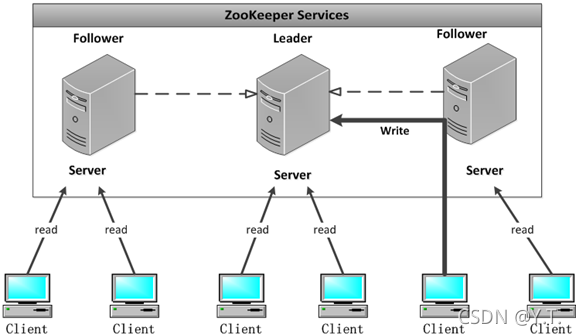

# Zookeeper

顾名思义 zookeeper 就是动物园管理员，他是用来管 hadoop集群的管理员；它是一个分布式的、开源的程序协调服务，是 hadoop 项目下的一个子项目。他提供的主要功能包括：配置管理、名字服务、分布式锁、集群管理。

主要应用集群管理：
在分布式的集群中，经常会由于各种原因，比如硬件故障，软件故障，网络问题，有些 节点会进进出出。有新的节点加入进来，也有老的节点退出集群。这个时候，集群中其他机器需要感知到这种变化，然后根据这种变化做出对应的决策，zookeeper便可以解决这些问题。