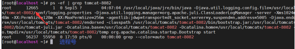
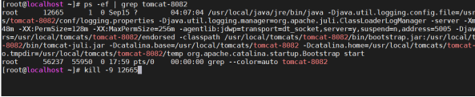
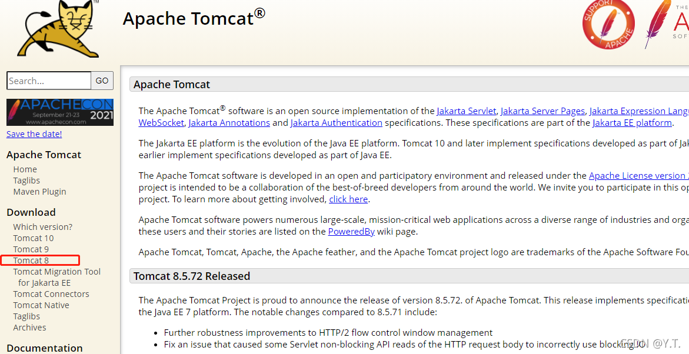
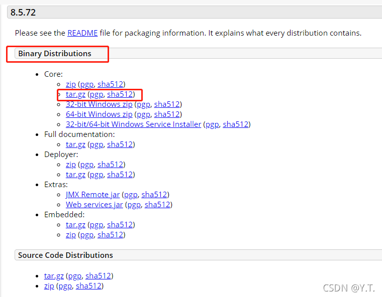
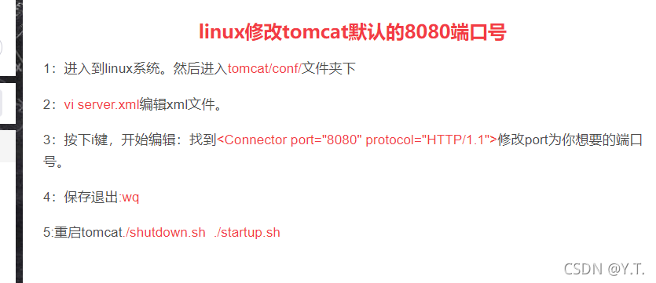
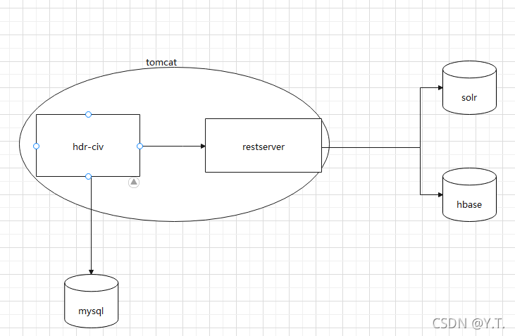

# Tomcat


tomcat是一个流行的web服务器，将程序包放置其中，方可处理浏览器的请求。


常用命令：

- 切换目录 — cd {路径}
- 启动tomcat服务—先切换到tomcat的bin目录，执行启动脚本 ./startup.sh
- 停止tomcat服务----先查看tomcat的进程号(例如 ps -ef|grep tomcat-8082），再使用kill -9 进程号关闭tomcat进程。






- 查看tomcat运行时日志—使用tail命令查看logs/catalina.out文件即可,例如tail -f ./logs/catalina.out,tail -f 表示查看文件末尾并不断追踪


## 1.2.1 安装步骤


官网(https://tomcat.apache.org/)下载tomcat，推荐版本（tomcat 8）





linux下载二进制文件核心包，放置服务器上（推荐为：/usr/local/tomcat目录下），使用解压命令解压（大括号之间为需要填充字段）


```shell
tar -zxvf -C /usr/local/tomcat/tomcat-{端口} {tomcat的tar包名称}
```





解压完毕后，更改tomcat端口号：





以上，完成tomcat的安装


## 1.2.2 tomcat中的统一视图





统一视图的应用包共有2个（hdr-civ.war和restserver.war），2个war包放置在tomcat的webapp目录下，启动tomcat后，将被tomcat自动识别解压出为2个同名文件夹（即启动了2个同名应用）。<br/>

hdr-civ负责处理用户请求逻辑并从mysql中读取用户配置及权限，最终给用户展示页面；restserver接收hdr-civ的请求，去solr和hbase查询数据，返回给civ处理。


