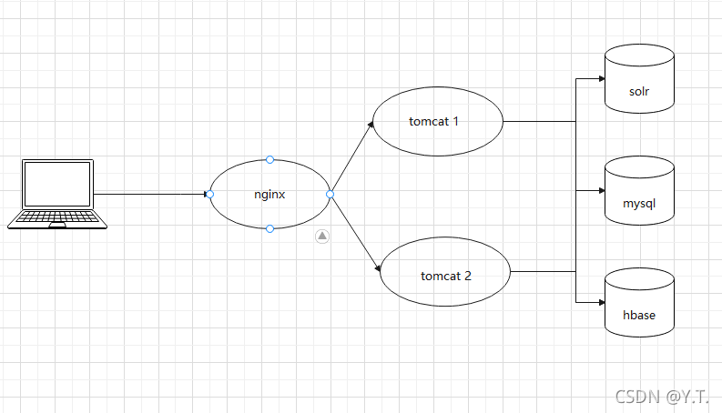
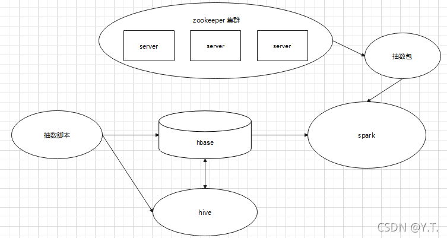
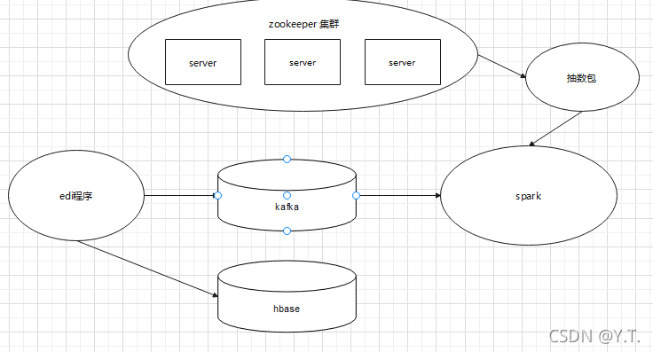
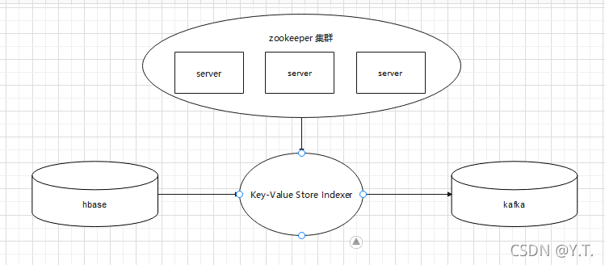

# 组件

## 1.1.1 统一视图应用

如图，用户通过浏览器访问统一视图过程：

- 浏览器输入nginx地址（8080端口，例如：192.168.xx.xx:8080/hdr-civ）。
- nginx 8080 端口接收到请求，自动根据用户IP将请求转发到合适的tomcat（一般为8082端口），保证tomcat负载均衡。
- tomcat处理请求，并向数据源查询数据，计算后展示给用户。
- 在3大数据源中，mysql负责存用户配置及权限数据，solr负责存储用于搜索的数据，hbase存出医院产生的患者就诊数据。

## 1.1.2 统一视图患者就诊列表solr全量抽数

### 简要描述图中各组件作用：

- zookeeper： 负责登记其他各组件的位置和上下线状态。抽数包配置zookeeper集群的地址后，即可从zookeeper获取正常运行的其他各组件地址，从而使用其他组件。
- hbase：存储数据。
- spark：充分利用多个服务器的硬件资源进行快速计算。
- hive：使用效果像mysql一样，存储数据，并利用sql语句进行计算。本质上也是利用多个服务器的硬件资源进行计算，不过效率较慢。

### 全量抽数的流程：

- 第一步，使用脚本在hbase里新建一张表存储hive计算结果（简称为：结果表）。
- 第二步，通过脚本设定，使用hive组件从hbase的一些表中拿出数据计算，算出患者末次就诊记录后存到结果表中。
- 第三步，通过脚本设定，使用spark组件执行抽数包程序，读取结果表进行计算，以结果表为基础，快速整合散落于多张hbase表里的数据，组成患者就诊列表，存进solr里。

## 1.1.3 统一视图患者就诊列表solr实时抽数

kafka：是一种消息队列，消息就是各种数据，比如mysql的一条记录便可称为一个消息。做个比喻，在超市结账时，人群排成一队，等待收银员结账，结完账的人会离开队列，当消息存进Kafka里时，也会像这样排队等待处理，处理完的消息会离队，即被删除掉。显而易见，kafka近似于一个存放临时数据的数据库。

### 实时抽数的流程：
实时就诊的门诊就诊和入出转通过集成平台调用数据中心EDI接口存入hbase表（`HDR_OUT_VISIT`和`HDR_PAT_ADT`）和kafka中，使用sqark按抽数包程序监测kafka的topic消息，进行实时更新患者末次就诊列表的solr数据

## 1.1.4 统一视图患者基本信息solr全量抽数

患者基本信息的solr字段跟hbase的`HDR_PATIENT`表的字段一致，运算量不大，直接利用hadoop本身的计算功能完成数据抽取。

## 1.1.5 统一视图患者基本信息solr实时抽数

Key-Value Store Indexer ：用于同步hbase数据和solr的数据的索引器。 
非常直接，患者基本信息solr利用索引器配置的映射关系，将hbase的字段各自映射到solr中。
