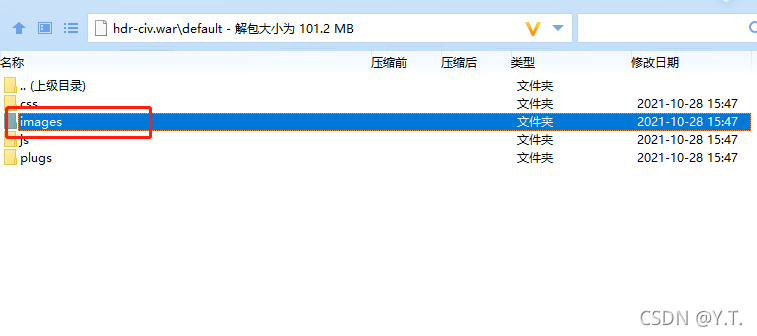

# 患者统一视图LOGO信息配置

| 配置项                  | 取值        | 说明                   |
| ----------------------- | ----------- | ---------------------- |
| IF_LOGO_SWITCH          | true或false | 是否切换使用自定义logo |
| HOSPITAL_LOGO_FILE_NAME | 文件名      | logo图片文件名         |
| HOSPITAL_LOGO_NAME      | 医院的名称  | logo对应的医院名称     |

将logo图片放置于war包的default/images目录下

