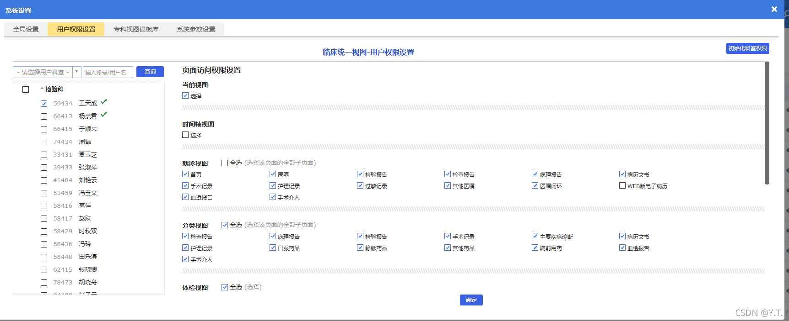
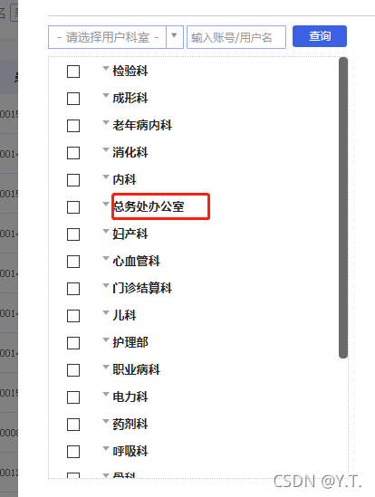
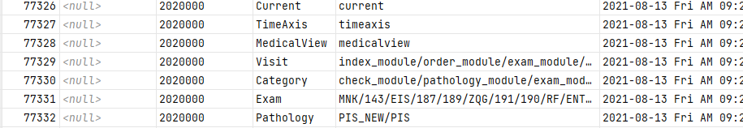

# 视图权限配置

管理员用户固定开启就诊视图和分类视图，其他视图根据相关配置决定；
非管理员用户，根据mysql中存储的用户的权限判断各视图开启状态及展示内容

权限页面会根据不同用户和不同部门进行变化

##### 未单击用户列表时

刚进入权限页面未单击用户列表时，默认展示的是管理员的权限视图，其权限来自于各视图对应的配置项。

| 配置项                      | 取值                                  | 说明                                   |
| --------------------------- | ------------------------------------- | -------------------------------------- |
| CIV_CATEGORY_VALUE          | 各模块编码，用正斜杠分隔              | 分类视图访问权限，存在默认值，永不为空 |
| CIV_VISIT_VALUE             | 各模块编码，用正斜杠分隔              | 就诊视图访问权限，存在默认值，永不为空 |
| CIV_CURRENT_VALUE           | current-开启；其他字符-关闭           | 是否开启当前视图                       |
| CIV_MEDICAL_VALUE           | medicalview-开启；其他字符-关闭       | 是否开启体检视图                       |
| CIV_SPECIALTY_VALUE         | specialty-开启；其他字符-关闭         | 是否开启专科视图                       |
| CIV_SPECIALTYTIMEAXIS_VALUE | specialtytimeaxis-开启；其他字符-关闭 | 是否开启专科视图时间轴                 |
| CIV_TIMEAXIS_VALUE          | timeaxis-开启；其他字符-关闭          | 是否开启时间轴                         |
| CIV_EMR_VALUE               | MR_CLASS_CODE,用正斜杠分隔            | 获取病历文书类别。存在默认值，永不为空 |
| CIV_PATHOLOGY_VALUE         | EXAM_CLASS_CODE,用正斜杠分隔          | 获取病理报告类别。存在默认值，永不为空 |
| CIV_EXAM_VALUE              | EXAM_CLASS_CODE,用正斜杠分隔          | 获取检查报告类别。存在默认值，永不为空 |

#####  左侧用户列表单击部门时

如果，部门之前未配置过权限（即权限为空时），自动获取跟管理员一样的权限视图，并将该权限往mysql的civ_power_config_dept表中插入。

单击部门名称修改权限，**注意不要点勾选（只单击部门名称，将修改civ_power_config_dept表，勾选之后将轮询该部门下每个用户，修改其在civ_power_config表的记录，会非常慢)**。
经过修改后，新的权限记录会覆盖掉之前插入的数据，再单击部门名称，将展示部门的权限视图。

##### 左侧用户列表单击用户时

**单击用户名称时（不是勾选）**，将尝试从mysql数据库的civ_power_config表中查询用户权限，若该用户从未配置过权限（表中无记录），则查询出该用户的部门的权限。
勾选用户后，将采用轮询的方式，修改所有勾选的用户的权限。