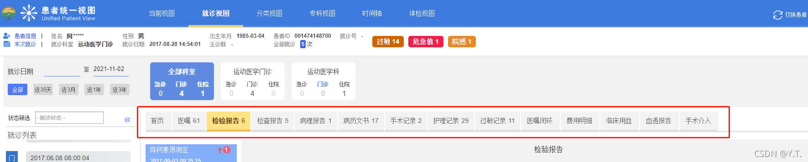
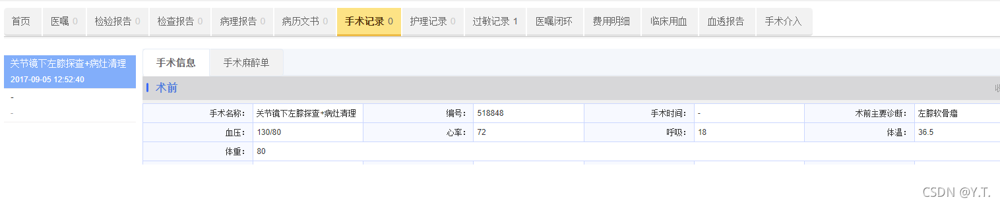

# 全局信息


##### 3.4.1.1 获取所有的visit_type_code|patient_id组合

现场环境下，门诊系统和住院系统可能采用不同的patient_id，因此通过`visit_type_code|patient_id`组合（简称`pid|vtype`）才能唯一确定一名患者。再进入就诊视图时，会自动查询所有的pid|vtype。


其查询逻辑为：
第一步，根据之前患者列表选中的末次就诊的`patient_id`和`visit_type_code`到`HDR_PATIENT`表中查询该患者的`EID`。
第二步，根据`EID`去患者基本信息collection中，查出所有的`pid|vtype`。


##### 3.4.1.2 获取就诊视图全局配置


传入当前登陆用户的用户编码，获取就诊视图配置


| 配置项                          | 取值                                              | 说明                                       |
| ------------------------------- | ------------------------------------------------- | ------------------------------------------ |
| CIV_LAB_REPORT_DETAIL_HEAD      | json格式                                          | 检验报告详情显示列配置，有默认值，永不为空 |
| VISIT_DEPT_SELECT_CONFIG        | on–开启，off–关闭                                 | 是否开启就诊试图科室筛选                   |
| CIV_VISIT_VALUE                 | 以正斜杠分隔的模块id                              | 就诊视图访问权限，存在默认值，永不为空     |
| CIV_MODULES                     | 新增的模块信息                                    | 新增模块                                   |
| CIV_HIDDEN_VISIT_LIST_VISITID   | true或false                                       | 是否隐藏就诊次                             |
| CIV_ORDERSTATUS                 | 医嘱状态列表                                      | 获取医嘱状态名称列表                       |
| SHOW_OPER_LIST                  | 1–有，0–没有                                      | 是否有手术列表项                           |
| CIV_ANESTHESIA_CONFIG           | 名称                                              | 手麻表单显示名                             |
| CIV_NURSE_TABLE_HEAD            | 表头列表                                          | 护理单表头设置                             |
| FEE_TABLE_OUT_CHARGE_CONFIG     | json                                              | 门诊费用表格头部设置                       |
| FEE_TABLE_IN_CHARGE_CONFIG      | json                                              | 住院费用表格头部设置                       |
| LAB_OVER_TIME                   | true或false                                       | 检验是否超时                               |
| EXAM_OVER_TIME                  | true或false                                       | 检查是否超时                               |
| IS_EMR_DG_HTML                  | true或false                                       | 是否使用病例章节模板                       |
| SCNNAR_SHOW_WITH_VISIT          | true或false                                       | 末次就诊栏是否跟随就诊次的变化而变化       |
| VISIT_ORDER_ALL_SHOW_CONFIG     | json                                              | 就诊视图医嘱显示列配置                     |
| blood_apply_view_display_column | json                                              | 临床用血 输血申请显示列配置                |
| prepare_blood_display_column    | json                                              | 临床用血 配血记录显示列配置                |
| blood_view_column               | json                                              | 临床用血 输血记录显示列配置                |
| VISIT_TIME_CHOICE_CONFIG        | 1–全部；2–近30天；3–近3个月；4–近3年；其他–近一年 | 就诊试图，卡片默认查询时间范围             |


###### 3.4.1.2.1 检验报告详情显示列配置

`CIV_LAB_REPORT_DETAIL_HEAD`影响页面


###### 3.4.1.2.2 是否开启就诊试图科室筛选

`VISIT_DEPT_SELECT_CONFIG`影响页面


###### 3.4.1.2.3 就诊视图访问权限

管理员用户：配置在`CIV_VISIT_VALUE`中的模块将会开放，新增模块需要结合`CIV_MODULES`，详见3.4.1.2.4 节。
非管理员用户：根据3.2.1节的权限配置，读取mysql中相应的表，获取开放的模块。若个人的权限为空，将采用部门的权限。

开放的模块


###### 3.4.1.2.4 新增模块并开放

第一步，配置url相关信息
在页面新增调用第三方url所需配置项，默认格式：


| 配置项编码                             | 配置项值              | 示例                                                         |
| -------------------------------------- | --------------------- | ------------------------------------------------------------ |
| SD_${系统编码}_URL                     | 调用地址              | http://192.168.2.202:8089/ocl/orderTrack/orderTrack.jsp/rpc?username=admin&patientid=#{patientId}&visitid=#{visitId}&way=em |
| SD_#{系统编码}_LINKTYPE                | 连接类型              | Iframe                                                       |
| SD_#{系统编码}_PARAM_NUM               | url里非固定定参数个数 | 2                                                            |
| SD_#{系统编码}_PARAMETER_FIELD1        | 第一个参数            | patientId（#与url对应）                                      |
| SD_#{系统编码}_PARAMETER_FIELD_CONFIG1 | 第一个参数来源        | IN_PATIENT_ID,HDR_IN_ORDER（#字段名,来源表）                 |
| SD_#{系统编码}_PARAMETER_FIELD2        | 第二个参数            | visitId                                                      |
| SD_#{系统编码}_PARAMETER_FIELD_CONFIG2 | 第二个参数来源        | VISIT_ID,HDR_IN_ORDER                                        |


**有几个参数就配置几组`SD_#{系统编码}_PARAMETER_FIELD`和`SD_#{系统编码}_PARAMETER_FIELD_CONFIG`**

第二步， 配置`CIV_MODULES`识别新增的模块

在页面搜素配置项`CIV_MODULES`，往里面新增新模块的参数信息。
配置格式：

```java
#{id},#{系统名称},#{系统编码},#{系统排序}
```

- 多个模块信息之间用英文分号隔开，示例：

```java
test2,测试模块111,TEST,100;fcqy_ylzx_module,国家妇产区域医疗中心,FCQY_YLZX,110
```

第三步，开放权限

需要模块在哪里显示就开启哪个页面的权限

- 就诊视图开放权限：
  在配置项`CIV_VISIT`中添加`#{系统id}`和`#{系统名称}`
  在配置项`CIV_VISIT_VALUE`中添加`#{系统id}`
  然后在权限管理页面勾选权限
- 分类视图开放权限
  在配置项`CIV_CATEGORY`中添加`#{系统id}`和`#{系统名称}`
  在配置项`CIV_CATEGORY_VALUE`中添加`#{系统id}`
  然后在权限管理页面勾选权限

###### 3.4.1.2.5 是否隐藏就诊次

`CIV_HIDDEN_VISIT_LIST_VISITID`影响页面


###### 3.4.1.2.6 获取医嘱状态列表

`CIV_ORDERSTATUS`影响页面


###### 3.4.1.2.7 是否显示手术列表

`SHOW_OPER_LIST`取0时 ，将调用第三方url


`SHOW_OPER_LIST`取1时 ，将查询hbase显示手术列表



###### 3.4.1.2.8 手术麻醉单显示配置

`CIV_ANESTHESIA_CONFIG`影响页面


###### 3.4.1.2.9 护理单表头设置

`CIV_NURSE_TABLE_HEAD`影响页面


###### 3.4.1.3.0 费用表格头部设置

```
FEE_TABLE_OUT_CHARGE_CONFIG` 和 `FEE_TABLE_IN_CHARGE_CONFIG`默认值

`FEE_TABLE_IN_CHARGE_CONFIG
[{"display":"编码","key":true,"hidden":true,"name":"code"},{"display":"项目编码","name":"project_code","column":"BILL_ITEM_CODE"},{"display":"项目名称","name":"name","column":"BILL_ITEM_NAME"},{"display":"计费时间","name":"time","column":"CHARGE_TIME"},{"display":"单价","name":"price","column":"CHARGE_ITEM_PRICE"},{"display":"单位","name":"cell","column":"DRUG_AMOUNT_UNIT"},{"display":"数量","name":"account","column":"CHARGE_AMOUNT_VALUE"},{"display":"总金额","name":"totl_account","column":"CHARGE_FEE"},{"display":"计费人","name":"order_status","column":"CHARGE_OPER_NAME"},{"display":"开单医生","name":"doctor","column":"ORDER_DOCTOR_NAME"}]
FEE_TABLE_OUT_CHARGE_CONFIG
[{"display":"编码","key":true,"hidden":true,"name":"code"},{"display":"项目编码","name":"project_code","column":"BILL_ITEM_CODE"},{"display":"项目名称","name":"name","column":"BILL_ITEM_NAME"},{"display":"计费时间","name":"time","column":"CHARGE_TIME"},{"display":"单价","name":"price","column":"CHARGE_ITEM_PRICE"},{"display":"单位","name":"cell","column":"DRUG_AMOUNT_UNIT"},{"display":"数量","name":"account","column":"CHARGE_AMOUNT_VALUE"},{"display":"总金额","name":"totl_account","column":"CHARGE_FEE"},{"display":"计费人","name":"order_status","column":"CHARGE_OPER_NAME"},{"display":"开单医生","name":"doctor","column":"ORDER_DOCTOR_NAME"}]
```

影响页面


###### 3.4.1.3.1 末次就诊栏是否跟随就诊次变化

`SCNNAR_SHOW_WITH_VISIT`为true时，末次就诊栏显示选中的就诊次信息，为false时显示末次就诊信息


###### 3.4.1.3.2 卡片默认查询时间范围

根据`VISIT_TIME_CHOICE_CONFIG`的取值，确定在进入就诊视图时默认的查询范围。


