# 医嘱模块


##### 3.4.8.1 医嘱模块涉及的配置

| 配置项                      | 取值                                   | 说明                                          |
| --------------------------- | -------------------------------------- | --------------------------------------------- |
| ORDER_SHORT_PROPERTY_CONFIG | 默认值： 临时                          | 临时医嘱名称，对应`ORDER_PROPERTIES_NAME`字段 |
| ORDER_LONG_PROPERTY_CONFIG  | 默认值： 长期                          | 长期医嘱名称，对应`ORDER_PROPERTIES_NAME`字段 |
| ORDER_STATUS                | 配置示例：撤销,废弃                    | 需要排除的医嘱状态                            |
| VISIT_ORDER_ALL_SHOW_CONFIG | json，有默认值                         | 医嘱显示列配置                                |
| OCL_MZ_KFFilter             |                                        | 门诊口服药品医嘱查询条件                      |
| OCL_KFFilter                |                                        | 住院口服药品医嘱查询条件                      |
| OrderClose_MZ_DRUG_KF       | `ORDER_CLASS_CODE`的值，用英文逗号分隔 | 门诊口服用药医嘱类别                          |
| OrderClose_DRUG_KF          | `ORDER_CLASS_CODE`的值，用英文逗号分隔 | 住院口服用药医嘱类别                          |
| OCL_MZ_JMZSFilter           |                                        | 门诊静脉输液药品医嘱查询条件                  |
| OCL_JMZSFilter              |                                        | 住院静脉输液药品医嘱查询条件                  |
| OrderClose_MZ_DRUG_JMZS     | `ORDER_CLASS_CODE`的值，用英文逗号分隔 | 门诊静脉输液药品医嘱类别                      |
| OrderClose_DRUG_JMZS        | `ORDER_CLASS_CODE`的值，用英文逗号分隔 | 住院静脉输液药品医嘱类别                      |
| OCL_MZ_QTFilter             |                                        | 门诊其他用药医嘱查询条件                      |
| OCL_QTFilter                |                                        | 住院其他用药医嘱查询条件                      |
| OrderClose_MZ_DRUG_QTYP     |                                        | 门诊其他用药医嘱类别                          |
| OrderClose_DRUG_QTYP        |                                        | 住院其他用药医嘱类别                          |
| OrderClose_MZ_LAB           |                                        | 门诊检验申请医嘱类别                          |
| OrderClose_LAB              |                                        | 住院检验申请医嘱类别                          |
| LAB_OVER_TIME               | true或false                            | 是否显示超时信息                              |
| OrderClose_MZ_EXAM          | `ORDER_CLASS_CODE`的值，用英文逗号分隔 | 门诊检查申请医嘱类别                          |
| OrderClose_EXAM             | `ORDER_CLASS_CODE`的值，用英文逗号分隔 | 住院检查申请医嘱类别                          |
| OrderClose_MZ_OPER          |                                        | 门诊手术医嘱类别                              |
| OrderClose_OPER             |                                        | 住院手术医嘱类别                              |
| OCL_MZ_OthersFilter         |                                        | 门诊其他医嘱查询条件                          |
| OCL_INPV_OthersFilter       |                                        | 住院其他医嘱查询条件                          |
| OrderClose_OTHERS           |                                        | 住院其他医嘱类别                              |
| OrderClose_MZ_OTHERS        |                                        | 门诊其他医嘱类别                              |

###### `VISIT_ORDER_ALL_SHOW_CONFIG`配置示例

```
{
  "0": [
    {
      "display": "医嘱类别",
      "name": "orderClassName",
      "width": 80,
      "field": "ORDER_CLASS_NAME"
    },
    {
      "display": "医嘱性质",
      "name": "orderPropertiesName",
      "field": "ORDER_PROPERTIES_NAME"
    },
    {
      "display": "医嘱项",
      "name": "orderItemName",
      "field": "ORDER_ITEM_NAME"
    },
    {
      "display": "医嘱开始时间",
      "name": "orderBeginTime",
      "field": "ORDER_BEGIN_TIME"
    },
    {
      "display": "医嘱结束时间",
      "name": "orderEndTime",
      "field": "ORDER_END_TIME"
    },
    {
      "display": "执行频次",
      "name": "frequencyName",
      "field": "FREQUENCY_NAME",
      "width": 60
    },
    {
      "display": "持续时间",
      "name": "durationValue",
      "field": "DURATION_VALUE",
      "width": 50
    },
    {
      "display": "医嘱状态",
      "name": "orderStatusName",
      "field": "PRES_STATUS_NAME",
      "width": 60
    },
    {
      "display": "医嘱编号",
      "name": "orderNo",
      "field": "ORDER_NO"
    },
    {
      "display": "医嘱类型",
      "name": "orderType",
      "field": "-"
    }
  ],
  "1": [
    {
      "display": "医嘱性质1",
      "name": "orderPropertiesName",
      "field": "ORDER_PROPERTIES_NAME"
    },
    {
      "display": "医嘱开始时间",
      "name": "orderBeginTime",
      "field": "CHARGE_TIME",
      "width": 75
    },
    {
      "display": "医嘱结束时间",
      "name": "orderEndTime",
      "field": "PRESC_TIME",
      "width": 75
    },
    {
      "display": "医嘱名称",
      "name": "orderItemName",
      "field": "CHARGE_NAME",
      "width": 80
    },
    {
      "display": "剂量",
      "name": "dosageValue",
      "field": "TOTAL_DOSAGE_VALUE"
    },
    {
      "display": "单位",
      "name": "dosageUnit",
      "field": "TOTAL_DOSAGE_UNIT"
    },
    {
      "display": "用法",
      "name": "pharmacyWayName",
      "field": "PHARMACY_WAY_NAME"
    },
    {
      "display": "频率",
      "name": "frequencyName",
      "field": "FREQUENCY_NAME"
    },
    {
      "display": "医嘱类型",
      "name": "orderClassName",
      "field": "ORDER_CLASS_NAME",
      "width": 60
    },
    {
      "display": "开立人",
      "name": "orderDoctorName",
      "field": "ORDER_DOCTOR_NAME",
      "width": 50
    },
    {
      "display": "开立时间",
      "name": "orderTime",
      "field": "ORDER_TIME",
      "width": 75
    },
    {
      "display": "当前状态",
      "name": "orderStatusName",
      "field": "PRES_STATUS_NAME",
      "width": 60
    },
    {
      "display": "医嘱编号",
      "name": "orderNo",
      "field": "ORDER_NO"
    }
  ],
  "2": [
    {
      "display": "医嘱性质2",
      "name": "orderPropertiesName",
      "field": "ORDER_PROPERTIES_NAME",
      "width": 80
    },
    {
      "display": "开始时间",
      "name": "orderBeginTime",
      "field": "CHARGE_TIME",
      "width": 75
    },
    {
      "display": "结束时间",
      "name": "orderEndTime",
      "field": "PRESC_TIME",
      "width": 75
    },
    {
      "display": "组标志",
      "name": "parentOrderNo",
      "field": "PARENT_ORDER_NO"
    },
    {
      "display": "医嘱名称",
      "name": "orderItemName",
      "field": "CHARGE_NAME",
      "width": 80
    },
    {
      "display": "剂量",
      "name": "dosageValue",
      "field": "TOTAL_DOSAGE_VALUE"
    },
    {
      "display": "单位",
      "name": "dosageUnit",
      "field": "TOTAL_DOSAGE_UNIT"
    },
    {
      "display": "用法",
      "name": "pharmacyWayName",
      "field": "PHARMACY_WAY_NAME"
    },
    {
      "display": "频率",
      "name": "frequencyName",
      "field": "FREQUENCY_NAME"
    },
    {
      "display": "医嘱类型",
      "name": "orderClassName",
      "field": "ORDER_CLASS_NAME",
      "width": 60
    },
    {
      "display": "开立人",
      "name": "orderDoctorName",
      "field": "ORDER_DOCTOR_NAME",
      "width": 50
    },
    {
      "display": "开立时间",
      "name": "orderTime",
      "field": "ORDER_TIME",
      "width": 75
    },
    {
      "display": "医嘱编号",
      "name": "orderNo",
      "field": "ORDER_NO"
    },
    {
      "display": "当前状态",
      "name": "orderStatusName",
      "field": "PRES_STATUS_NAME",
      "width": 60
    }
  ],
  "4": [
    {
      "display": "医嘱性质4",
      "name": "orderPropertiesName",
      "field": "ORDER_PROPERTIES_NAME",
      "width": 80
    },
    {
      "display": "开始时间",
      "name": "orderBeginTime",
      "field": "CHARGE_TIME",
      "width": 75
    },
    {
      "display": "结束时间",
      "name": "orderEndTime",
      "field": "PRESC_TIME",
      "width": 75
    },
    {
      "display": "组标志",
      "name": "parentOrderNo",
      "field": "PARENT_ORDER_NO"
    },
    {
      "display": "医嘱名称",
      "name": "orderItemName",
      "field": "CHARGE_NAME",
      "width": 80
    },
    {
      "display": "剂量",
      "name": "dosageValue",
      "field": "TOTAL_DOSAGE_VALUE"
    },
    {
      "display": "单位",
      "name": "dosageUnit",
      "field": "TOTAL_DOSAGE_UNIT"
    },
    {
      "display": "用法",
      "name": "pharmacyWayName",
      "field": "PHARMACY_WAY_NAME"
    },
    {
      "display": "频率",
      "name": "frequencyName",
      "field": "FREQUENCY_NAME"
    },
    {
      "display": "医嘱类型",
      "name": "orderClassName",
      "field": "ORDER_CLASS_NAME",
      "width": 60
    },
    {
      "display": "开立人",
      "name": "orderDoctorName",
      "field": "ORDER_DOCTOR_NAME",
      "width": 50
    },
    {
      "display": "开立时间",
      "name": "orderTime",
      "field": "ORDER_TIME",
      "width": 75
    },
    {
      "display": "医嘱编号",
      "name": "orderNo",
      "field": "ORDER_NO"
    },
    {
      "display": "当前状态",
      "name": "orderStatusName",
      "field": "PRES_STATUS_NAME",
      "width": 60
    }
  ],
  "6": [
    {
      "display": "医嘱名称",
      "name": "orderItemName",
      "field": "ORDER_ITEM_NAME"
    },
    {
      "display": "医嘱类型",
      "name": "orderClassName",
      "field": "ORDER_CLASS_NAME"
    },
    {
      "display": "开立人",
      "name": "orderDoctorName",
      "field": "ORDER_DOCTOR_NAME"
    },
    {
      "display": "开立时间",
      "name": "orderTime",
      "field": "ORDER_TIME"
    },
    {
      "display": "当前状态",
      "name": "reportStatus",
      "field": "REPORT_STATUS"
    },
    {
      "display": "医嘱编号",
      "name": "orderNo",
      "field": "ORDER_NO"
    }
  ],
  "6.1": [
    {
      "display": "医嘱名称",
      "name": "orderItemName",
      "field": "ORDER_ITEM_NAME"
    },
    {
      "display": "医嘱类型",
      "name": "orderClassName",
      "field": "ORDER_CLASS_NAME"
    },
    {
      "display": "开立人",
      "name": "orderDoctorName",
      "field": "ORDER_DOCTOR_NAME"
    },
    {
      "display": "开立时间",
      "name": "orderTime",
      "field": "ORDER_TIME"
    },
    {
      "display": "是否超时",
      "name": "overTime",
      "field": "-"
    },
    {
      "display": "当前状态",
      "name": "reportStatus",
      "field": "REPORT_STATUS"
    },
    {
      "display": "医嘱编号",
      "name": "orderNo",
      "field": "ORDER_NO"
    }
  ],
  "8": [
    {
      "display": "医嘱名称",
      "name": "orderItemName",
      "field": "ORDER_ITEM_NAME"
    },
    {
      "display": "医嘱类型",
      "name": "orderClassName",
      "field": "ORDER_CLASS_NAME"
    },
    {
      "display": "开立人",
      "name": "orderDoctorName",
      "field": "ORDER_DOCTOR_NAME"
    },
    {
      "display": "开立时间",
      "name": "orderTime",
      "field": "ORDER_TIME"
    },
    {
      "display": "当前状态",
      "name": "reportStatus",
      "field": "REPORT_STATUS"
    },
    {
      "display": "医嘱编号",
      "name": "orderNo",
      "field": "ORDER_NO"
    }
  ],
  "8.1": [
    {
      "display": "医嘱名称",
      "name": "orderItemName",
      "field": "ORDER_ITEM_NAME"
    },
    {
      "display": "医嘱类型",
      "name": "orderClassName",
      "field": "ORDER_CLASS_NAME"
    },
    {
      "display": "开立人",
      "name": "orderDoctorName",
      "field": "ORDER_DOCTOR_NAME"
    },
    {
      "display": "开立时间",
      "name": "orderTime",
      "field": "ORDER_TIME"
    },
    {
      "display": "是否超时",
      "name": "overTime",
      "field": "OVER_TIME"
    },
    {
      "display": "当前状态",
      "name": "reportStatus",
      "field": "REPORT_STATUS"
    },
    {
      "display": "医嘱编号",
      "name": "orderNo",
      "field": "ORDER_NO"
    }
  ],
  "5": [
    {
      "display": "拟手术名称",
      "name": "operationName",
      "field": "OPERATION_NAME"
    },
    {
      "display": "开立人",
      "name": "orderDoctorName",
      "field": "ORDER_DOCTOR_NAME"
    },
    {
      "display": "开立时间",
      "name": "orderTime",
      "field": "ORDER_TIME"
    },
    {
      "display": "施术者",
      "name": "planOperDoctorName",
      "field": "PLAN_OPER_DOCTOR_NAME"
    },
    {
      "display": "术前诊断",
      "name": "diagBeforeOperationName",
      "field": "DIAG_BEFORE_OPERATION_NAME"
    },
    {
      "display": "手术日期",
      "name": "applyOperTime",
      "field": "PLAN_OPER_TIME"
    },
    {
      "display": "医嘱编号",
      "name": "orderNo",
      "field": "ORDER_NO"
    }
  ],
  "12": [
    {
      "display": "医嘱名称",
      "name": "orderItemName",
      "field": "ORDER_ITEM_NAME"
    },
    {
      "display": "剂量",
      "name": "dosageValue",
      "field": "DOSAGE_VALUE"
    },
    {
      "display": "频率",
      "name": "frequencyName",
      "field": "FREQUENCY_NAME"
    },
    {
      "display": "医嘱类",
      "name": "orderClassName",
      "field": "ORDER_CLASS_NAME"
    },
    {
      "display": "护理等级",
      "name": "orderItemName",
      "field": "ORDER_ITEM_NAME"
    },
    {
      "display": "开立人",
      "name": "orderDoctorName",
      "field": "ORDER_DOCTOR_NAME"
    },
    {
      "display": "开立时间",
      "name": "orderTime",
      "field": "ORDER_TIME"
    },
    {
      "display": "开始时间",
      "name": "orderBeginTime",
      "field": "ORDER_BEGIN_TIME"
    },
    {
      "display": "结束时间",
      "name": "orderEndTime",
      "field": "ORDER_END_TIME"
    },
    {
      "display": "医嘱性质",
      "name": "orderPropertiesName",
      "field": "ORDER_PROPERTIES_NAME"
    },
    {
      "display": "医嘱状态",
      "name": "orderStatusName",
      "field": "ORDER_STATUS_NAME"
    },
    {
      "display": "CESHI",
      "name": "STAY_DEPT_NAME",
      "field": "STAY_DEPT_NAME"
    },
    {
      "display": "医嘱编号",
      "name": "orderNo",
      "field": "ORDER_NO"
    }
  ]
}
```

按顺序，每个数字编号对应一个页面。特殊的，6和6.1,8和8.1对应同样的页面，前者是未启用超时配置读取的配置，后者则是启用时读取的。

field对应hbase的字段，name对应返回给前端的字段（无要求），display为展示名称。

**默认配置有必须的字段，尽量不要删除，可以任意增加其他字段。**

##### 3.4.8.2 医嘱模块接口

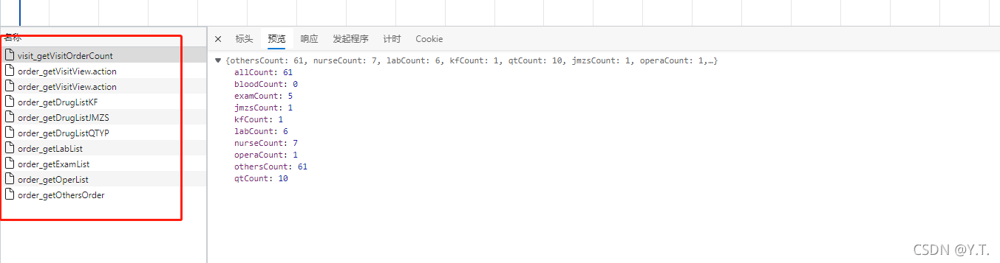

##### 3.4.8.3 全部医嘱查询逻辑

查询的表名：门诊医嘱–`HDR_OUT_ORDER`；住院医嘱–`HDR_IN_ORDER`

根据页面输入，获取查询条件：


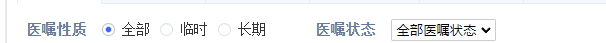


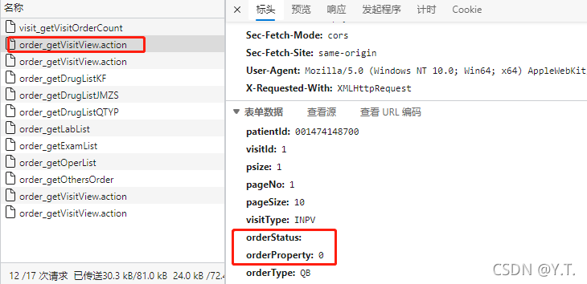

医嘱性质条件：
全部----orderProperty=0-----不作为条件查询；
临时----orderProperty=1-----条件为：{`ORDER_PROPERTIES_NAME` 包含 `ORDER_SHORT_PROPERTY_CONFIG`的值}；
长期—orderProperty=2----条件为：{`ORDER_PROPERTIES_NAME` 包含 `ORDER_LONG_PROPERTY_CONFIG`的值}；

医嘱状态条件：
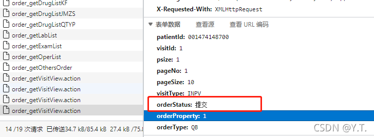

{ORDER_STATUS_NAME 相似 orderStatus}

结合上述页面输入的条件，再读取配置`ORDER_STATUS`增加条件{`ORDER_STATUS_NAME` 不包含 配置的值}，从对应的医嘱表中查询需要的字段，按配置`VISIT_ORDER_ALL_SHOW_CONFIG`第0项展示

##### 3.4.8.4 口服用药查询逻辑

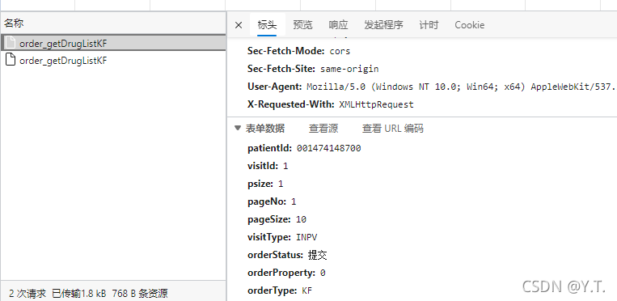

根据就诊类型，查询医嘱表（参照3.4.8.3 节）。
根据页面输入，获取部分查询条件（参照3.4.8.3 节）。
根据就诊类型读取口服药品医嘱查询条件配置，拼接成查询条件之一。
根据配置增加排除医嘱的条件（参照3.4.8.3 节）。
读取口服用药医嘱类别配置，增加条件：{`ORDER_CLASS_CODE` in 配置值}
根据pid和vid，结合所有查询条件，查询医嘱表，获取数据，根据医嘱显示列配置第1项展示。

##### 3.4.8.5 静脉注射查询逻辑

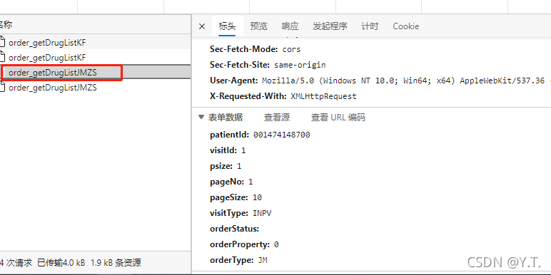

参照口服用药查询逻辑（3.4.8.4），读取静脉注射对应的配置，查询，根据医嘱显示列配置第2项展示。

##### 3.4.8.6 其他用药查询逻辑

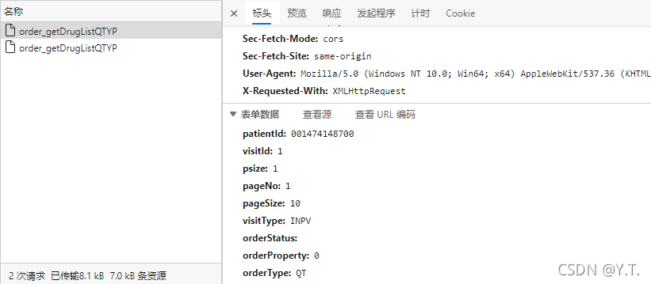

参照口服用药查询逻辑（3.4.8.4），读取静脉注射对应的配置，查询，根据医嘱显示列配置第4项展示。

##### 3.4.8.7 检验申请查询逻辑

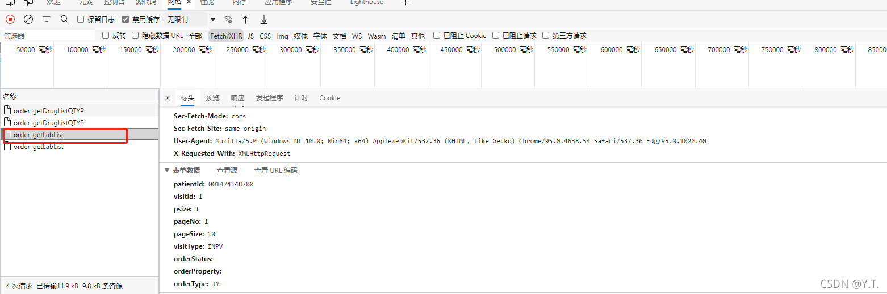

参照口服用药查询逻辑（3.4.8.4），读取对应的配置，查询医嘱，若打开超时配置，根据医嘱显示列配置第6.1项展示，否则按医嘱显示列配置第6项展示。

##### 3.4.8.8 检查申请查询逻辑

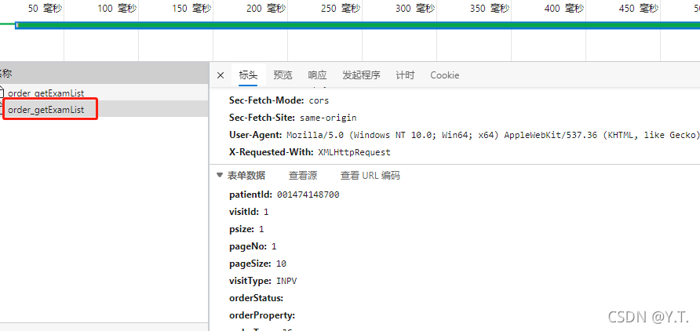

参照口服用药查询逻辑（3.4.8.4），读取对应的配置，查询医嘱，若打开超时配置，根据医嘱显示列配置第8.1项展示，否则按医嘱显示列配置第8项展示。

##### 3.4.8.9 手术查询逻辑

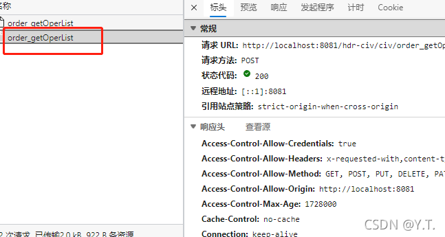

参照口服用药查询逻辑（3.4.8.4），读取对应的配置，查询医嘱，按医嘱显示列配置第5项展示。

##### 3.4.9.0 其他医嘱

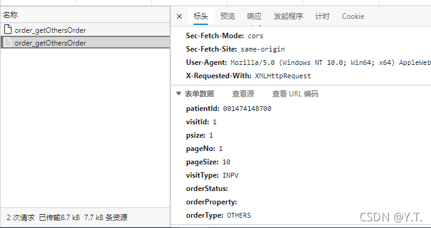

参照口服用药查询逻辑（3.4.8.4），读取对应的配置，查询医嘱，按医嘱显示列配置第12项展示。