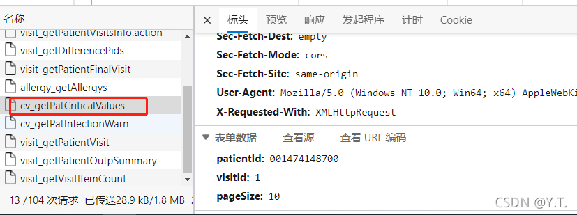

# 危急值提醒


对应接口：


查询逻辑：
根据pid和`visit_id`查询`HDR_CRITICAL_VALUES`表，获取字段：

```
"LAB_ITEM_NAME", "LAB_SUB_ITEM_NAME", "LAB_SUB_ITEM_CODE", 
"CRISIS_VALUE", "RANGE", "REPORT_TIME",
 "OPERATOR_NAME", "OPERATE_TIME", "CRISIS_FLAG", "ORDER_NO"
```

再利用表中的`LAB_SUB_ITEM_CODE`和`ORDER_NO`作为查询条件，结合pid和`visit_id`，查询`HDR_LAB_REPORT_DETAIL`表，获取字段：

```
LAB_ITEM_NAME
```

