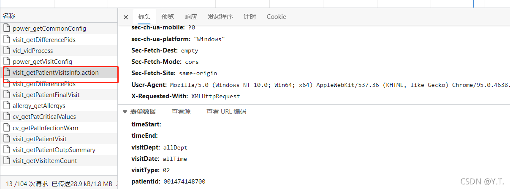
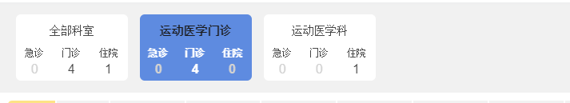
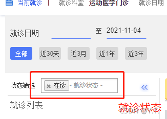
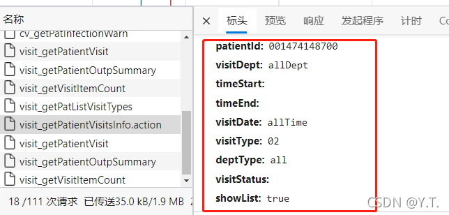

# 就诊列表和就诊卡片

[TOC]


##### 3.4.3.1 对应接口

可以看到接口传参中，部分参数是根据页面输入得到的



##### 3.4.3.2 涉及到的配置

| 配置项                | 取值        | 说明           |
| --------------------- | ----------- | -------------- |
| VISIT_SHOW_VID_CONFIG | 默认值：all | 是否显示就诊次 |


##### 3.4.3.3 查询逻辑

简单概况：
根据pid|vtype的组合，查询`HDR_PATIENT`表，获取`EID`
再根据患者`EID`，在solr的患者基本信息collection中查询出所有的`pid|vtype`组合
再根据所有的`pid|vtype`组合，查询得到所有的就诊记录
从就诊记录中获取科室统计后的就诊数据 ，进行部门条件筛选

部门条件筛选：


###### 3.4.3.3.1查询出所有就诊记录

第一步，获取次patientid下的所有诊断：
住院患者（vtype=02）,根据`pid`查询`HDR_EMR_CONTENT_DIAG`表，读取`CIV_PAT_MAINDIAG_INP_FILTER`添加查询条件），获取字段。
（**该配置有默认值，若为空，则自动读取默认值`DIAGNOSIS_PROPERTY_CODE|in|2,3;DIAGNOSIS_NUM|=|1;DIAGNOSIS_SUB_NUM|=|0`**）

```
"DIAGNOSIS_CODE", "DIAGNOSIS_NAME", "DIAGNOSIS_TIME", "DIAGNOSIS_DOCTOR_CODE",
"DIAGNOSIS_DOCTOR_NAME", "DIAGNOSIS_DESC", "VISIT_ID"
```

再根据`pid`查询`HDR_INP_SUMMARY_DIAG`表，读取`CIV_PAT_MAINDIAG_INP_FILTER`添加查询条件，获取字段

```
"DIAGNOSIS_CODE", "DIAGNOSIS_NAME", "DIAGNOSIS_TIME", "DIAGNOSIS_DESC", "DIAGNOSIS_NUM", "DIAGNOSIS_TYPE_NAME", "VISIT_ID"
```

门诊患者（vtype=01）,根据`pid`查询表`HDR_OUT_VISIT_DIAG`，读取字段

```
"DIAGNOSIS_CODE", "DIAGNOSIS_NAME", "DIAGNOSIS_TIME", "DIAGNOSIS_DOCTOR_CODE",
"DIAGNOSIS_DOCTOR_NAME", "DIAGNOSIS_DESC", "VISIT_ID"
```

急诊患者（vtype=00）,根据`pid`查询`HDR_OUT_VISIT_DIAG`，查询条件为：{`EMERGENCY_VISIT_IND` = true},读取字段：

```
DIAGNOSIS_CODE", "DIAGNOSIS_NAME", "DIAGNOSIS_TIME", "DIAGNOSIS_DOCTOR_CODE",
 "DIAGNOSIS_DOCTOR_NAME", "DIAGNOSIS_DESC", "VISIT_ID
```

第二步，进行数据处理后，返回给前端展示


住院患者，就诊日期对应入院时间`ADMISSION_TIME`，就诊状态对应`VISIT_STATUS_CODE`
门诊患者，就诊日期对应就诊时间`VISIT_TIME`，就诊状态对应`VISIT_STATUS_CODE`
根据页面输入，构造查询条件，具体值看前端传参。例如：{`ADMISSION_TIME` 大于等于 2019-10-1,`VISIT_STATUS_CODE` 等于 “”}


住院患者，根据pid和vtype，结合页面上输入的条件查询表`HDR_PAT_ADT`，获取字段：

```
DEPT_DISCHARGE_FROM_CODE", "DEPT_DISCHARGE_FROM_NAME", "ADMISSION_TIME",
 "DISCHARGE_TIME", "VISIT_ID", "DEPT_ADMISSION_TO_NAME", "DEPT_ADMISSION_TO_CODE", "INP_NO",
"IN_PATIENT_ID", "TRANS_NO", "CURR_DEPT_NAME", "CURR_DEPT_CODE", "DISTRICT_ADMISSION_TO_NAME", "VISIT_STATUS_CODE", "VISIT_STATUS_NAME", "APPOINT_REG_SOURCE_CODE", "APPOINT_REG_SOURCE_NAME
```

**存在转科的，只取最后一次记录**。

`TRANS_NO`=0的，科室取入院科室（`DEPT_ADMISSION_TO_NAME`），否则取当前科室（`CURR_DEPT_NAME`）。
若患者在院（`DISCHARGE_TIME`为空），则主诊断取`HDR_EMR_CONTENT_DIAG`的诊断数据
若患者出院，则主诊断取`HDR_INP_SUMMARY_DIAG`的诊断数据。
将查询的数据

门诊患者，根据pid，结合页面上输入的条件查询`HDR_OUT_VISIT`表，
若是急诊患者（vtype=00）,增加条件：{`EMERGENCY_VISIT_IND` 等于 true}，
获取字段：

```
"REGISTING_TIME", "VISIT_TIME", "VISIT_ID", "VISIT_DEPT_NAME",
 "VISIT_DEPT_CODE", "VISIT_FLAG", "OUT_PATIENT_ID", "EMERGENCY_VISIT_IND",
 "VISIT_STATUS_NAME", "OUTP_NO", "VISIT_STATUS_CODE", "VISIT_STATUS_NAME", "APPOINT_REG_SOURCE_CODE", "APPOINT_REG_SOURCE_NAME
```

若就诊时间没有，用挂号时间代替，其他字段正常返回给前端展示。