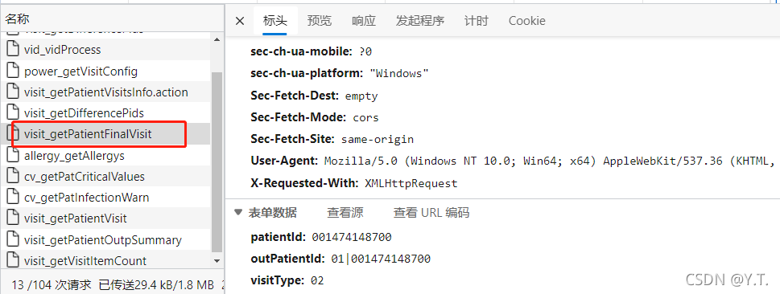

## 末次就诊信息


##### 3.2.4.2.1 末次就诊涉及到的配置

| 配置项                       | 取值 | 说明                 |
| ---------------------------- | ---- | -------------------- |
| CIV_OUT_VISIT_FILTER         |      | 门诊查询条件过滤器   |
| PATIENT_LAST_VISIT_INFO_VIEW |      | 末次就诊显示配置     |
| CIV_PAT_MAINDIAG_INP_FILTER  |      | 住院主诊断条件过滤器 |

`CIV_OUT_VISIT_FILTER`示例：

```
格式：hbase字段名|操作符|值;hbase字段名|操作符|值
VISIT_ID|=|1;VISIT_DEPT_NAME|=|检验科
```

`PATIENT_LAST_VISIT_INFO_VIEW`末次就诊显示配置：

```
patient_id=患者ID;name=姓名;sex=性别;age=年龄;
visit_type=就诊类型;visit_no=门诊号;visit_dept=就诊科室;
main_diag=主诊断;visit_time=就诊日期;admission_time=入院日期;
in_no=住院号;birthday=出生年月;bed_no=床号;visit_num=全部就诊
```

末次就诊显示配置对应的页面：

`CIV_PAT_MAINDIAG_INP_FILTER`默认配置：

```
DIAGNOSIS_PROPERTY_CODE|in|2,3;DIAGNOSIS_NUM|=|1;DIAGNOSIS_SUB_NUM|=|0
```

##### 3.2.4.2.2 对应接口

末次就诊信息接口返回的响应分为2部分

- 末次就诊显示配置
- 末次就诊数据
  

##### 3.2.4.2.3 末次就诊数据查询逻辑：

###### 3.2.4.2.3.1 查询就诊记录

前端传入前获取到的所有visit_type_code|patient_id组合（3.4.1.1小节），结合患者当前就诊的pid|vtype，组成一个列表。循环遍历该列表，利用每一对pid、vtype查询：
住院类型查询`HDR_PAT_ADT`表，查询条件为：{`VISIT_TYPE_CODE` = 02}，获取的字段为：

```
"VISIT_ID", "ADMISSION_TIME", "PERSON_NAME", "SEX_NAME", 
"IN_PATIENT_ID", "OUT_PATIENT_ID", "DATE_OF_BIRTH",
"VISIT_TYPE_CODE", "CURR_BED_LABEL",
"DEPT_ADMISSION_TO_CODE", "DEPT_ADMISSION_TO_NAME",
"CURR_DEPT_NAME", "CURR_DEPT_CODE", "BED_LABEL",
"ADMISSION_TIME", "INP_NO", "TRANS_NO",
"DISTRICT_ADMISSION_TO_NAME", "DISCHARGE_TIME"
```

门诊类型查询`HDR_OUT_VISIT`表，先读取配置`CIV_OUT_VISIT_FILTER`，构造查询条件。

获取的字段为：

```
"VISIT_TIME", "VISIT_ID", "VISIT_DEPT_NAME", "OUTP_NO", "IN_PATIENT_ID",
 "OUT_PATIENT_ID", "VISIT_DEPT_CODE", "VISIT_TYPE_CODE", "PERSON_NAME", "SEX_NAME",
 "DATE_OF_BIRTH", "VISIT_FLAG"
```

###### 3.2.4.2.3.2 记录去重

存在转科的情况下去重，只留下转科情况的最后一次转科记录(`TRANS_NO`最大的)。
第三步，将部分字段进行特殊处理后，跟其他字段一起返回给前端展示。

###### 3.2.4.2.3.3 部分数据特殊处理

- 住院患者，若不存在转科（`TRANS_NO`=0）

```
就诊科室 显示 DEPT_ADMISSION_TO_NAME床号   显示  BED_LABEL
```

- 住院患者，若存在转科（`TRANS_NO`不等于0）

```
就诊科室 显示 CURR_DEPT_NAME （该字段为空时，使用 DEPT_ADMISSION_TO_NAME）床号 显示 CURR_BED_LABEL （该字段为空时，使用BED_LABEL）
```

姓名、性别、出生日期空值处理：
若之前的查询中姓名、性别、出生日期为空值，则从`HDR_PATIENT`表中，再次查询姓名、性别、出生日期。

- 主诊断：

住院患者（`VISIT_TYPE_CODE`等于02），在院时（`DISCHARGE_TIME`为空）
根据`IN_PATIENT_ID`和`VISIT_ID`查询`HDR_EMR_CONTENT_DIAG`表，读取配置`CIV_PAT_MAINDIAG_INP_FILTER`添加查询条件，**若配置为空，读取配置默认值**

获取字段：

```
DIAGNOSIS_CODE", "DIAGNOSIS_NAME", "DIAGNOSIS_TIME", "DIAGNOSIS_DOCTOR_CODE", "DIAGNOSIS_DOCTOR_NAME", "DIAGNOSIS_DESC", "VISIT_ID
```

住院患者，出院时（`DISCHARGE_TIME`不为空）
根据`IN_PATIENT_ID`和`VISIT_ID`查询`HDR_INP_SUMMARY_DIAG`表，读取配置`CIV_PAT_MAINDIAG_INP_FILTER`添加查询条件，**若配置为空，读取配置默认值**。
获取字段：

```
"DIAGNOSIS_CODE", "DIAGNOSIS_NAME", "DIAGNOSIS_TIME", "DIAGNOSIS_DESC", "DIAGNOSIS_NUM", "DIAGNOSIS_TYPE_NAME", "VISIT_ID"
```

存在出院后归档前补充患者就诊信息的情况，如果出院了病案诊断表（`HDR_INP_SUMMARY_DIAG`）里面没有数据，再回头从病历诊断（`HDR_EMR_CONTENT_DIAG`）里面取数据。

非住院患者（`VISIT_TYPE_CODE`不等于02）：
查询表`HDR_OUT_VISIT_DIAG`，查询条件：{`MAIN_FLAG`=1}，查询字段：

```
"DIAGNOSIS_CODE", "DIAGNOSIS_NAME", "DIAGNOSIS_TIME", "DIAGNOSIS_DOCTOR_CODE", "DIAGNOSIS_DOCTOR_NAME", "DIAGNOSIS_DESC", "VISIT_ID"
```

- 患者过敏次数
  循环遍历所有的pid|vtype组合，查询`HDR_ALLERGY`，查询的总记录数为过敏次数。