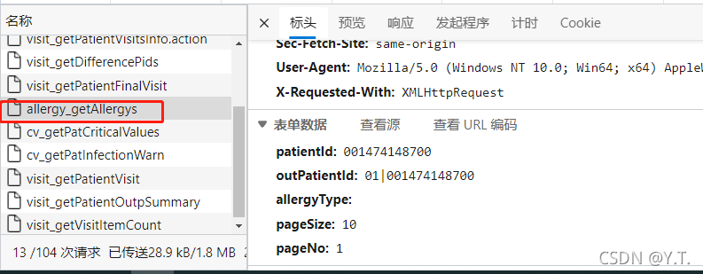

# 过敏提醒


对应接口



查询逻辑：
根据全部的pid查询`HDR_ALLERGY`表，获取字段：

```
"ALLERGY_CATEGORY_NAME", "ALLERGEN", "ALLERGEN_NAME", "ALLERGY_REASON", "ALLERGY_REASON_NAME",
"ALLERGY_REACTION", "ALLERGY_SEVERITY", "ALLERGY_SEVERITY_NAME", "OPERATOR_NURSE",
 "OPERATOR_NURSE_NAME", "OPERATE_NURSE_TIME", "RECORD_PERSON", "RECORD_PERSON_NAME",
"RECORDTIME", "ALLERGY_NAME"
```