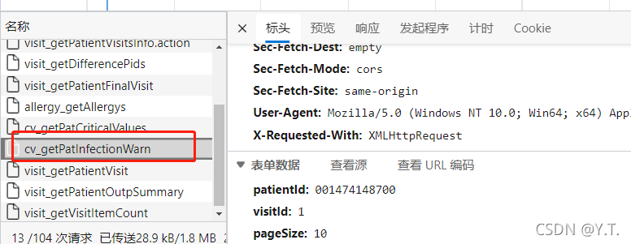

#  院感提醒




查询逻辑：
根据pid和vid查询`HDR_INFECTION_WARN`表，获取字段：


```
"INFECTED_DIAG", "INFECTED_POSITION", "INFECTED_TIME", "INFECTED_BACTERIA",
 "INFECTED_TIMES", "INFECTED_SOURCE", "SUSPICIOUS_DIAG"
```

