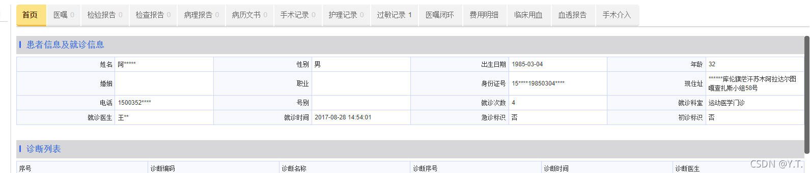
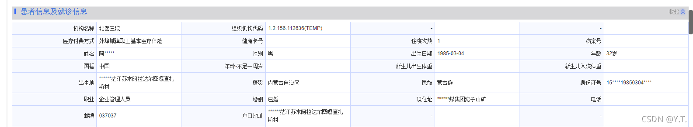
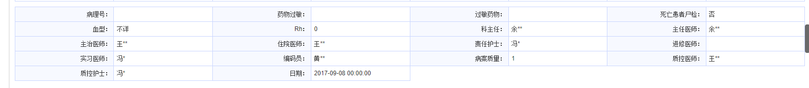
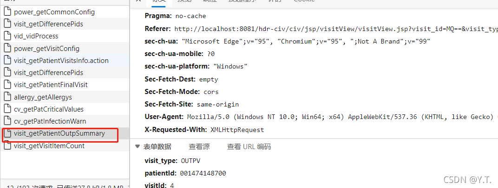
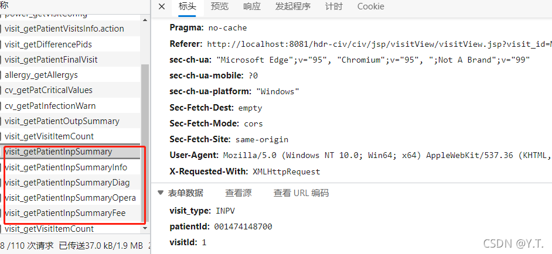
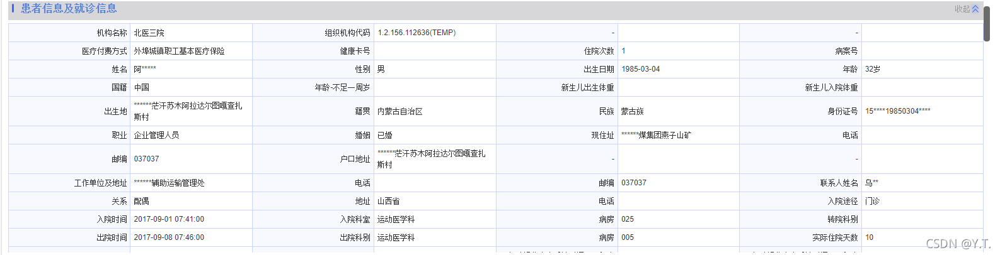
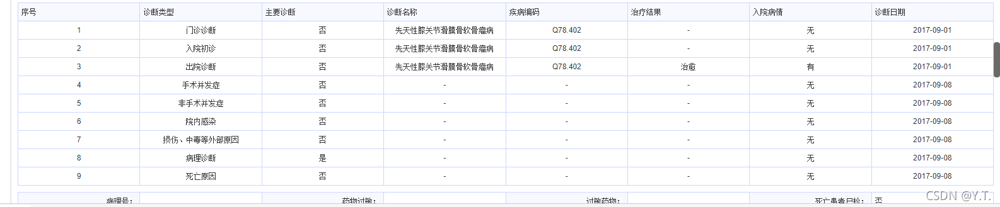
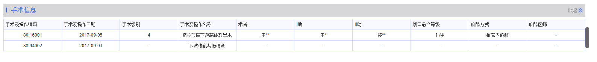
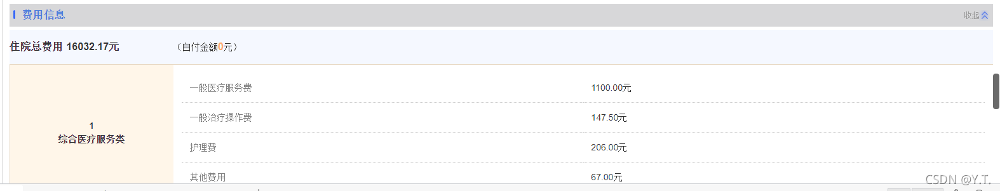

# 首页模块


首页模块会根据当次就诊类型展示不同的内容。

##### 3.4.7.1 首页模块涉及的配置

| 配置项                   | 取值 | 说明                 |
| ------------------------ | ---- | -------------------- |
| CIV_VISIT_OUTP_SUNNARY   |      | 门诊首页字段         |
| CIV_VISIT_SUNNARY        |      | 住院首页字段         |
| CIV_VISIT_SUNNARY_INFO   |      | 住院首页诊断部分字段 |
| VISIT_SUMMARY_FEE_COLUMN |      | 住院费用字段         |

`CIV_VISIT_OUTP_SUNNARY`配置示例

```
姓名,PERSON_NAME;性别,SEX_NAME;出生日期,DATE_OF_BIRTH;年龄,AGE_VALUE;婚姻,MARITAL_STATUS_NAME;职业,OCCUPATION_NAME;身份证号,ID_CARD_NO;现住址,MAILING_ADDRESS;电话,PHONE_NUMBER;号别,REG_CATEGORY_NAME;就诊次数,VISIT_ID;就诊科室,VISIT_DEPT_NAME;就诊医生,VISIT_DOCTOR_NAME;就诊时间,VISIT_TIME;急诊标识,EMERGENCY_VISIT_IND;初诊标识,FIRSTV_INDICATOR
```

`CIV_VISIT_OUTP_SUNNARY`配置效果

`CIV_VISIT_SUNNARY`配置示例

```
机构名称,ORG_NAME;组织机构代码,ORG_OID;-,-;-,-;医疗付费方式,CHARGE_TYPE;健康卡号,HEALTH_CARD_NO;住院次数,VISIT_ID;病案号,CASE_NO;姓名,PERSON_NAME;性别,SEX_NAME;出生日期,DATE_OF_BIRTH;年龄,AGE_VALUE;国籍,NATION_NAME;年龄-不足一周岁,BABY_AGE;新生儿出生体重,BABY_BIRTH_WEIGHT;新生儿入院体重,BABY_ADMIN_WEIGHT;出生地,BIRTH_ADDRESS;籍贯,NATIVE_PROVINCE_NAME;民族,NATIONALITY_NAME;身份证号,ID_CARD_NO;职业,OCCUPATION_NAME;婚姻,MARITAL_STATUS_NAME;现住址,MAILING_ADDRESS;电话,PHONE_NUMBER;邮编,POSTCODE;户口地址,FAMILY_ADDRESS;-,-;-,-;工作单位及地址,EMPLOYER_ADDRESS;电话,BUSINESS_PHONE_PHONE;邮编,EMPLOYER_POSTCODE;联系人姓名,NEXT_OF_KIN;关系,RELATIONSHIP_NAME;地址,NEXT_OF_KIN_ADDR;电话,NEXT_OF_KIN_PHONE;入院途径,ADMISSION_CLASS_NAME;入院时间,ADMISSION_TIME;入院科室,DEPT_ADMISSION_TO_NAME;病房,WARD_ADMISSION_TO_NAME;转院科别,ORIGIN_DEPT;出院时间,DISCHARGE_TIME;出院科别,DEPT_DISCHARGE_FROM_NAME;病房,WARD_DISCHARGE_FROM;实际住院天数,IN_HOSPITAL_DAYS;离院方式,DISCHARGE_CLASS_NAME;拟接收医疗机构名称,RECEIVE_ORG;颅脑损伤患者昏迷时间：（入院前）,BEFORE_COMA_TIME;颅脑损伤患者昏迷时间：（入院后）,IN_COMA_TIME
```

`CIV_VISIT_SUNNARY`配置效果

`CIV_VISIT_SUNNARY_INFO`配置示例

```
病理号：,PATHOLOGY_NO;药物过敏：,DRUG_ALLERGY_INDICATOR;过敏药物：,DRUG_ALLERGY_NAME;死亡患者尸检：,AUTOPSY_INDICATOR;血型：,BLOOD_TYPE_NAME;Rh：,RH_BLOOD_NAME;科主任：,DEPT_DIRECTOR_NAME;主任医师：,SENIOR_DOCTOR_NAME;主治医师：,ATTENDING_DOCTOR_NAME;住院医师：,INP_DOCTOR_NAME;责任护士：,PRIMARY_NURSE_NAME;进修医师：,FURTHER_DOCTOR;实习医师：,PRACTICAL_DOCTOR_NAME;编码员：,CATALOGER_NAME;病案质量：,RECORD_QUALITY_NAME;质控医师：,QC_DOCTOR_NAME;质控护士：,QC_NURSE_NAME;日期：,QC_DATE
```

`CIV_VISIT_SUNNARY_INFO`配置效果

`VISIT_SUMMARY_FEE_COLUMN`配置格式

```
#{主分类},#{字段code},#{字段名称};#{主分类},#{字段code},#{字段名称};
```

##### 3.4.7.2 首页模块对应接口：

- 门诊：
  
- 住院：
  

##### 3.4.7.3 门诊查询逻辑

根据pid和vid从`HDR_OUT_VISIT`表中查询，获取配置的字段，填充患者信息及就诊信息


再根据pid和vid从`HDR_OUT_VISIT_DIAG`中获取诊断数据，填充诊断列表。


##### 3.4.7.4 住院查询逻辑

填充患者信息及就诊信息。
根据pid和vid查询`HDR_INP_SUMMARY`表，获取配置的字段，填充并展示

填充诊断信息
根据pid和vid查询`HDR_INP_SUMMARY`表，获取配置的字段，填充并展示

填充诊断列表

根据pid和vid查询`HDR_INP_SUMMARY_DIAG`表，获取字段返回给前端展示。

```
"DIAGNOSIS_TYPE_NAME", "DIAGNOSIS_NUM", "DIAGNOSIS_SUB_NUM", "DIAGNOSIS_CODE",
"DIAGNOSIS_NAME", "DIAGNOSIS_TIME", "DIAGNOSIS_DOCTOR_NAME", "DIAGNOSIS_DESC",
"DIAGNOSIS_PART", "CATALOG_TIME", "DIAGNOSIS_DEPT_NAME", "TREAT_RESULT_NAME", "TREAT_DAYS",
"ADM_CONDITION_NAME"
```

填充手术信息

根据pid和vid查询`HDR_INP_SUMMARY_OPER`表，获取字段返回给前端展示。

```
"DIAGNOSIS_CODE", "OPER_APPLY_NO", "OPER_NO", "OPERATION_NAME", "OPERATION_DESC",
 "OPERATION_DATE", "CATALOG_TIME", "OPERATION_GRADE_NAME", "SURGEN_CODE", "SURGEN_NAME",
"FIRST_ASSISTANT_NAME", "SECOND_ASSISTANT_NAME", "ANESTHESIA_METHOD_NAME",
 "ANESTHESIA_DOCTOR_NAME", "ASA_GRADE_NAME", "WOUND_GRADE_NAME", "HEALING_GRADE_NAME",
 "OPERATION_CODE"
```

填充费用信息

根据pid和vid查询`HDR_INP_SUMMARY`表,固定获取字段：

```
"COUNT_CHARGE_FEE", "CHARGE_FEE1", "CHARGE_FEE2",
 "CHARGE_FEE3", "CHARGE_FEE4", "CHARGE_FEE5", "CHARGE_FEE6", "CHARGE_FEE7", "CHARGE_FEE8",
 "CHARGE_FEE9", "CHARGE_FEE10", "CHARGE_FEE11", "CHARGE_FEE12", "CHARGE_FEE13", "CHARGE_FEE14",
 "CHARGE_FEE15", "CHARGE_FEE16", "CHARGE_FEE17", "CHARGE_FEE18", "CHARGE_FEE19", "CHARGE_FEE20",
 "CHARGE_FEE21", "CHARGE_FEE22", "CHARGE_FEE23", "CHARGE_FEE24", "CHARGE_FEE25", "CHARGE_FEE26",
 "CHARGE_FEE27", "CHARGE_FEE28", "CHARGE_FEE29", "CHARGE_FEE30", "CHARGE_FEE31", "CHARGE_FEE32",
 "CHARGE_FEE33", "CHARGE_FEE34", "CHARGE_FEE35", "CHARGE_FEE36", "CHARGE_FEE37", "CHARGE_FEE38",
"CHARGE_FEE39", "CHARGE_FEE40"
```

此外，还可根据配置`VISIT_SUMMARY_FEE_COLUMN`额外获取字段。
将字段经过计算后，展示。