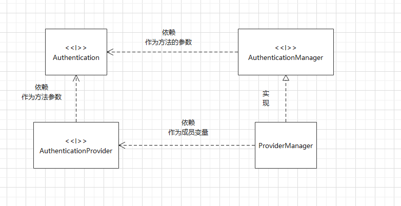
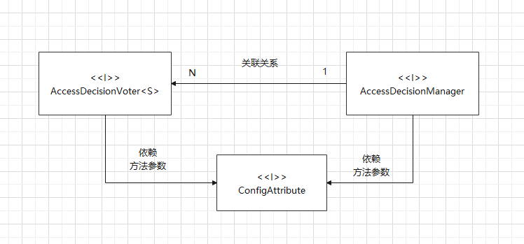

# 核心功能
spring security作为安全框架，最核心的功能在于两方面：
- 认证
- 授权
## 认证
spring security支持多种认证方式：
- 表单认证
- OAuth2.0 认证
- SAML2.0 认证
- CAS 认证
- RememberMe 自动认证
- HTTP Basic认证
## 授权
无论采用何种认证方式，都不影响授权功能。支持的授权方式包括：
- 基于URL的请求授权
- 方法访问授权
- 动态权限配置
- RBAC权限模型
# 整体架构
## 认证

用户的认证信息主要由`Authentication`接口的实现类来保存。

用户用不同的方式登陆时都会对应不同的`Authentication`实例

认证工作主要由`AuthenticationManager`接口负责。

`AuthenticationManager`最主要的实现类是`ProviderManager`,`ProviderManager`里维护了一个`AuthenticationProvider`列表。
不同的`Authentication`实例由不同的`AuthenticationProvider`来处理，所以`AuthenticationProvider`有一个`supports`方法，用于判断是否支持对应的`Authenticatioon`。

在项目中，可能同时支持多种登陆方式（比如表单登陆、扫码登陆、第三方登陆），因此会同时存在多个`AuthenticationProvider`，多个`AuthenticationProvider`统一由`ProviderManager`管理。
同时，`ProviderManager`有一个可选的`parent`，如果`AuthenticationProvider`列表都认证失败，就会调用`parent`进行认证。

## 授权
授权体系中，有2个关键接口：
- `AccessDecisionManager`
- `AccessDecisionVoter<S>`

`AccessDecisionVoter<S>`是一个投票器，会检查用户是否具备应有的角色，进而投出赞成、反对或弃权票。
`AccessDecisionManager`是一个决策器，来决定此次访问是否被允许。

`AccessDecisionVoter<S>`和`AccessDecisionManager`都有众多的实现类，在`AccessDecisionManager`中会遍历`AccessDecisionVoter<S>`，进而决定是否允许用户访问。

在spring security中，用户请求一个资源（通常是一个接口或一个方法）,所需要的角色会被封装成一个`ConfigAttribute`对象。

`ConfigAttribute`接口中只有一个方法，该方法返回一个字符串就是角色名称。
投票器的作用就是比较用户的角色和资源所需角色的关系。

## 实现方式

认证、授权等功能都是基于过滤器来完成。开发者所见的spring security提供的功能都是通过过滤器实现的，并且这些过滤器按既定的优先级排列，最终形成一个过滤器链。spring security常见的过滤器见官网[过滤器列表](https://docs.spring.io/spring-security/site/docs/5.3.12.RELEASE/reference/html5/#servlet-security-filters)

如图，spring security过滤器并不是直接放在web项目原生过滤器链中，而是通过一个`FilterChainProxy`来统一管理。
`FilterChainProxy`本身将通过Spring 框架提供的`DelegatingFilterProxy`整合到原生过滤器链中。

一个项目中存在多种认证体系时，security 过滤器链可能会有多个，多个过滤器链之间要指定优先级，当请求到达时，由`FilterChainProxy`进行分发，选择一条链进行处理。

