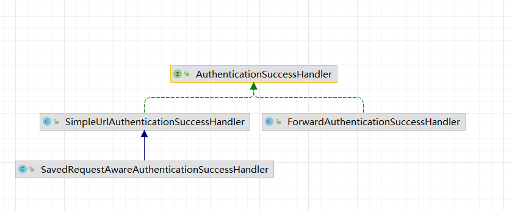

# 认证

## 用户对象
spring security中定义了`UserDetails`接口来规范开发者自定义的用户对象。

负责提供用户数据源的接口是`UserDetailsService`接口。项目中，一般需要开发自定义该接口的实现，从数据库中查询用户。
spring security也为`UserDetailsService`提供了默认实现，如`InMemoryUserDetailsManager`和`JdbcUserDetailsManager`。

## spring boot自动配置解析

### spring boot中用户对象的自动配置

spring boot中关于用户对象的自动配置路径为：`spring-boot-autoconfigure`包中的`org.springframework.boot.autoconfigure.security.servlet.UserDetailsServiceAutoConfiguration`、
从该类源码中可看到，有2个比较重要的条件，促使系统自动提供一个`InMemoryUserDetailsManager`实例：
- 当前 classpath下存在`AuthenticationManager`的类文件
- 当前项目中，IOC容器中没有`AuthenticationManager.class, AuthenticationProvider.class, UserDetailsService.class`的bean实例
~~~
@Configuration(proxyBeanMethods = false)
@ConditionalOnClass(AuthenticationManager.class)
@ConditionalOnBean(ObjectPostProcessor.class)
@ConditionalOnMissingBean(
		value = { AuthenticationManager.class, AuthenticationProvider.class, UserDetailsService.class },
		type = { "org.springframework.security.oauth2.jwt.JwtDecoder",
				"org.springframework.security.oauth2.server.resource.introspection.OpaqueTokenIntrospector" })
public class UserDetailsServiceAutoConfiguration {
~~~

从`inMemoryUserDetailsManager`方法中，可以看到用户数据源来自`SecurityProperties`。

~~~
@Bean
	@ConditionalOnMissingBean(
			type = "org.springframework.security.oauth2.client.registration.ClientRegistrationRepository")
	@Lazy
	public InMemoryUserDetailsManager inMemoryUserDetailsManager(SecurityProperties properties,
			ObjectProvider<PasswordEncoder> passwordEncoder) {
		SecurityProperties.User user = properties.getUser();
		List<String> roles = user.getRoles();
		return new InMemoryUserDetailsManager(
				User.withUsername(user.getName()).password(getOrDeducePassword(user, passwordEncoder.getIfAvailable()))
						.roles(StringUtils.toStringArray(roles)).build());
	}
~~~

从`SecurityProperties.User`类中，可以看到默认的用户名是user,默认的密码是UUID字符串,且由于`SecurityProperties`带有`@ConfigurationProperties(prefix = "spring.security")`，所以这些属性可以通过yml文件注入。
~~~
public static class User {

		/**
		 * Default user name.
		 */
		private String name = "user";

		/**
		 * Password for the default user name.
		 */
		private String password = UUID.randomUUID().toString();

		/**
		 * Granted roles for the default user name.
		 */
		private List<String> roles = new ArrayList<>();

~~~

### spring boot默认页面的生成
spring boot通过自动配置类，配置了2个和页面相关的过滤器：
- DefaultLoginPageGeneratingFilter
- DefaultLogoutPageGeneratingFilter

这些过滤器的doFilter方法处理用户的请求，生成html页面,通过响应返回给浏览器。

## 登陆表单的配置
在spring security中自定义配置，基本上都是继承自`WebSecurityConfigurerAdapter`来实现。
~~~
protected void configure(HttpSecurity http) throws Exception {
        http.authorizeRequests()
                .anyRequest().authenticated()
                .and()
                .formLogin()
                .loginPage("/mylogin.html")
                .loginProcessingUrl("/doLogin")
                .defaultSuccessUrl("/index.html")
                .failureUrl("/login.html")
                .usernameParameter("uname")
                .passwordParameter("passwd")
                .permitAll()
~~~
1. `authorizeRequests()`表示开启权限配置,`anyRequest().authenticated()`表示所有请求都要认证才能访问。
2. `formLogin()`表示开启表单登陆配置。
3. `loginPage()`用于指定登陆页面。
4. `loginProcessingUrl()`用于指定需要被处理的登陆请求url，与页面上的form表单的action属性一致。
5. `defaultSuccessUrl()`表示登陆成功后的跳转地址。
6. `failureUrl()`表示登陆失败的跳转地址。
7. `usernameParameter()`表示用户名的参数名称，与form表单一致。
8. `passwordParameter()`表示密码的参数名称，与form表单一致。
9. `permitAll()`表示跟登陆相关的页面和接口不做拦截。
### 登陆成功
当用户登陆成功之后，除了`defaultSuccessUrl`方法可以实现跳转,`successForwardUrl`也可以实现跳转，区别如下：
1. `defaultSuccessUrl`表示当用户登陆成功之后，会自动重定向到登陆之前的地址上。`successForwardUrl`则不考虑用户之前访问的地址，直接通过服务器转发跳转到指定页面。
2. `defaultSuccessUrl`有一个重载方法，如果重载方法第二个参数传入true，效果与`successForwardUrl`类似，重定向到指定页面。不同之处在于，`defaultSuccessUrl`是重定向，`successForwardUrl`是服务器转发。

无论是`defaultSuccessUrl`还是`successForwardUrl`，最终配置的都是`AuthenticationSuccessHandler`接口的实例。`AuthenticationSuccessHandler`接口专用于处理登陆成功的事情。

`AuthenticationSuccessHandler`有3个实现类：

1. `SimpleUrlAuthenticationSuccessHandler`实现了请求重定向。
2. `SavedRequestAwareAuthenticationSuccessHandler`在父类的基础上，增加了请求缓存功能，可以记录之前请求地址，进而在登陆成功后重定向到缓存地址。
3. `ForwardAuthenticationSuccessHandler`就是一个服务端跳转。

`AuthenticationSuccessHandler`默认的三个实现类都是用来处理页面跳转的。在前后端分离开发时，后端不需要处理页面，只要在登陆成功后，跟前端返回一个JSON数据。像这样的需求，我们可以自定义`AuthenticationSuccessHandler`的实现类来完成。
